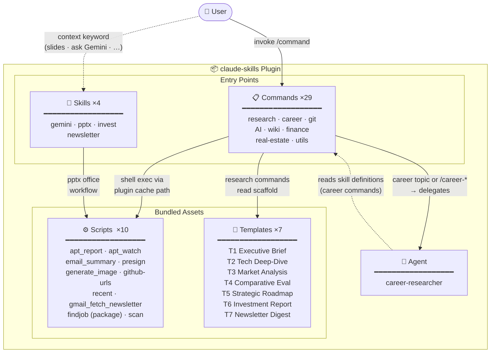

# Claude Skills

> A curated collection of slash commands, skills, and agents for [Claude Code](https://claude.ai/code) — covering research workflows, career development, productivity tools, and automation.


---

## Architecture



---

## What's Included

| Type | Count | Contents |
|------|-------|----------|
| Slash Commands | 29 | Research, career, git, AI tools, productivity, finance, real estate, newsletter, job finder, vault scan, tag management |
| Skills | 4 | `gemini` (Gemini CLI wrapper), `pptx` (PowerPoint toolkit), `invest` (portfolio analytics), `newsletter` (Gmail newsletter curation) |
| Agent | 1 | `career-researcher` (dedicated career research sub-agent) |
| Scripts | 10 | Python/shell scripts bundled with commands (`findjob` is a full Python package with 11 company parsers; `scan` is a bash+Python multi-file package) |
| Templates | 7 | T1–T7 research and curation report templates |

---

## Installation

> **Note**: Installation requires two steps — first register the marketplace, then install the plugin.
> Running `claude plugin install liks79/claude-skills` directly will fail with "not found in any configured marketplace"
> because `liks79/claude-skills` is a GitHub repo path, not a marketplace plugin identifier.

### Option 1 — Via Marketplace slash commands (Recommended)

```
/plugin marketplace add liks79/claude-skills
/plugin install claude-skills@liks79-skills
```

### Option 2 — CLI (two steps)

```bash
# Step 1: Register the marketplace (required before install)
claude plugin marketplace add liks79/claude-skills

# Step 2: Install the plugin using the marketplace plugin identifier
claude plugin install claude-skills@liks79-skills --scope user
```

### Option 3 — Manual (`settings.json`)

Add the following to `~/.claude/settings.json`:

```json
{
  "extraKnownMarketplaces": {
    "liks79-skills": {
      "source": {
        "source": "github",
        "repo": "liks79/claude-skills"
      }
    }
  },
  "enabledPlugins": {
    "claude-skills@liks79-skills": true
  }
}
```

---

## Commands

### Research & Knowledge Management

| Command | Description |
|---------|-------------|
| `/claude-skills:new-research <topic>` | Create a structured research note. Auto-selects one of five templates (T1–T5) based on topic keywords. Delegates career topics to the `career-researcher` agent. |
| `/claude-skills:apply-research-template <file> [Template N] [depth]` | Restructure an existing markdown file into a research template. Supports `--inplace` to overwrite the original. |
| `/claude-skills:scan [options]` | Scan the vault and build/update a research index. Extracts YAML frontmatter, titles, tags, and dates from all Markdown files. Generates a browsable index with year × month matrix and tag cloud. Incremental cache keeps subsequent runs fast. **Tested and verified with Quartz v5.0+.** |
| `/claude-skills:add-tags [options]` | Scan an Obsidian vault and assign tags to untagged markdown files using Claude Code natively (no API key required). Builds and maintains a `Tag_Dictionary.md` with tag statistics and untagged file list. Incremental cache with surgical `--paths` rescan for fast updates. **Quartz v5 compatible.** |
| `/claude-skills:wiki-ingest <file-or-url>` | Ingest a file, web URL, or YouTube video into an LLM-readable wiki. Extracts concepts and entities, creates cross-linked pages under `wiki/compiled/`. |
| `/claude-skills:wiki-query <question>` | Search the local wiki and synthesize an answer with `[[wikilink]]` citations. Optionally saves the result as a new synthesis page. |
| `/claude-skills:wiki-lint` | Audit wiki health: broken links, orphaned pages, missing frontmatter, stale entries (>90 days). Generates a report with action items. |

### Career Development

| Command | Description |
|---------|-------------|
| `/claude-skills:findjob [--output-dir PATH] [--db-path PATH]` | Scan 11 company career sites (AWS, Google, Microsoft, Anthropic, OpenAI, Databricks, Datadog, Cloudflare, Palantir, Redis, Coupang) for openings matching your configured positions and locations. Tracks changes via SQLite and generates a ranked Markdown report with new/removed positions delta. |
| `/claude-skills:findjob list` | Display current configuration — wanted locations, positions, score threshold, and a table of all registered companies with their location filters. No network requests made. |
| `/claude-skills:career-company-analysis <company>` | Web research on a company's tech stack, culture, interview process, and compensation. Saves a structured report to `career/companies/`. |
| `/claude-skills:career-job-analysis <URL-or-text>` | Analyze a job posting. Extracts requirements, performs gap analysis against your background, and lists resume keywords. |
| `/claude-skills:career-interview-prep <company> <role>` | Generate a structured interview prep guide covering coding, system design, behavioral, and technical deep-dive questions. |
| `/claude-skills:career-salary-research <role> [region] [years]` | Research market salary data from Blind, LinkedIn, Levels.fyi, and job boards. Produces a distribution table by experience level. |
| `/claude-skills:career-to-pptx <md-path>` | Convert a career markdown file (company analysis, job analysis, etc.) into a PowerPoint presentation using `python-pptx`. |

### Git & GitHub

| Command | Description |
|---------|-------------|
| `/claude-skills:ship [hint]` | Full git workflow: assess changes → create `claude/*` branch → stage → commit (Conventional Commits) → push → open PR with `gh`. |
| `/claude-skills:github-urls [N] [--pr N\|<sha>]` | Print GitHub URLs for the N most recently changed files. Use `--pr N` for files changed in a specific PR, or pass a commit SHA. |
| `/claude-skills:grass-tracker [username]` | Show GitHub contribution graph status using [grass-tracker](https://github.com/liks79/grass-tracker). Falls back to basic stats via `gh api` if the CLI is not installed. |

### AI Tools

| Command | Description |
|---------|-------------|
| `/claude-skills:gemini <prompt> [--model] [--file] [--diff] [--summary]` | Run a prompt through Google Gemini CLI. Supports code review (`--diff`), file summarization (`--summary`), and model selection. |
| `/claude-skills:image-gen <prompt> [--output] [--model]` | Generate images via Google Gemini API. Supports NanoBanana, NanoBanana 2 (default), NanoBanana Pro, Imagen 4, and Imagen 4 Fast models. |

### Productivity

| Command | Description |
|---------|-------------|
| `/claude-skills:email-summary [days]` | Fetch and classify Gmail messages by importance: 🔴 urgent, 🟡 important, 🔵 informational, ⚪ ads. Default: last 7 days. |
| `/claude-skills:email-archive [N] [--dry-run]` | Fetch unread inbox messages, assign labels via AI (newsletter, career, finance, security, etc.), and archive. Default: 50 messages. Use `--dry-run` to preview without changes. |
| `/claude-skills:newsletter --label <name\|id> [--days N]` | Fetch Gmail messages from a label, classify by topic (AI/BigTech/Startup/Tools), and generate a premium T7 intelligence digest report. Saves to `notes/newsletters/`. Default: last 7 days (max 90). |
| `/claude-skills:cal <event>` | Create or view Google Calendar events using natural language input (KST timezone). Supports Google Meet links and attendees. |
| `/claude-skills:presign <file> [hours]` | Upload a file to Cloudflare R2 or AWS S3 and return a presigned URL. Default expiry: 24 hours. |
| `/claude-skills:recent [N]` | List the N most recently modified files in the current directory tree. Default: 10. |

### Finance & Investment

| Command | Description |
|---------|-------------|
| `/invest [sheet_url]` | Read a Google Sheets investment portfolio via GWS CLI, fetch live market data, and generate a premium T6-template report covering allocation, performance, market intelligence, risk matrix, and action plan. Saves to `reports/finance/`. |
| `/claude-skills:share [md_path] [hours]` | Convert the most recent research `.md` to PDF via the `pdf-creator` plugin and upload to Cloudflare R2, returning a presigned URL (and optionally a Quartz URL). Defaults to the most recently modified file under `notes/` or `reports/`. **Requires:** `daymade-skills/pdf-creator` plugin installed. |

### Korea Real Estate

| Command | Description |
|---------|-------------|
| `/claude-skills:apt <region> [--months N] [--type] [--forecast N] [--pdf]` | Generate an apartment price report for Seoul/metropolitan districts using MOLIT official transaction data (data.go.kr). Includes trend charts and 6-month forecast. |
| `/claude-skills:apt-watch <complex-number\|URL> [--name] [--location] [--type] [--no-db] [--pdf]` | Track active listings for a specific apartment complex on Naver Real Estate. Accepts a complex number or full Naver URL. Detects new and removed listings via SQLite snapshot comparison. Use `--no-db` for a one-shot snapshot without writing to the change-tracking DB. |

### Meta

| Command | Description |
|---------|-------------|
| `/claude-skills:cmds` | List all commands provided by this plugin, grouped by category. |

---

### `/add-tags` — Obsidian Vault Tag Manager

> **No API key required** — Claude Code handles all tagging via its native Read/Edit tools. No Anthropic API calls.
> **Quartz v5 compatible**: uses standard `[title](path)` Markdown links (not wikilinks).

Scans an Obsidian vault and assigns tags to untagged Markdown files using Claude Code natively. Outputs a `Tag_Dictionary.md` with a tag statistics table and a list of untagged files.

**Key features:**
- **No API key** — Claude Code's Read/Edit tools process files directly (no external API)
- **Incremental cache** — only re-scans changed files; repeated runs stay fast
- **Surgical `--paths` rescan** — after tagging N files, re-reads only those N files O(N) instead of O(total)
- **Quartz v5 compatible** — `[tag](tags/tagname)` link format for tag page navigation

#### Usage

```
/add-tags                               → default scan + auto-assign tags (up to 50 files)
/add-tags --force                       → full rescan, ignore cache
/add-tags --no-assign                   → scan + build Tag Dictionary only (skip assignment)
/add-tags --delta                       → fast scan: only files newer than cache
/add-tags --paths "a.md,b.md"           → surgical rescan of specific files only
/add-tags --max-files 20                → limit files processed per run
/add-tags --output-dir notes            → override Tag Dictionary output directory
/add-tags --include-dirs 10_PARA,notes  → restrict scan to specific directories (default: all)
```

#### Scan Mode Reference

| Mode | When to use | Speed |
|------|-------------|-------|
| `--paths "f1,f2"` | Re-scan exactly the N files you just tagged | ⚡ Fastest |
| *(auto, cache exists)* | Default — delta scan via `find -newer cache` | 🚀 Fast |
| `--force` | Full rebuild or purge entries for deleted files | 🐢 Slow |
| *(auto, first run)* | No cache yet — full walk to initialize | 🐢 Slow |

#### Environment Variables

Configure in `~/.claude/settings.local.json` → `"env"` block:

| Variable | Default | Description |
|---|---|---|
| `ADD_TAGS_OUTPUT_DIR` | `00_INBOX` | Output directory for `Tag_Dictionary.md` |
| `ADD_TAGS_FILENAME` | `Tag_Dictionary.md` | Output filename |
| `ADD_TAGS_CACHE_DIR` | `<script_dir>/.cache` | Tag cache directory |

#### Plugin configuration (installed via plugin)

```json
// ~/.claude/settings.local.json
{
  "env": {
    "BASE_DIR":           "/absolute/path/to/your/vault",
    "ADD_TAGS_OUTPUT_DIR": "00_INBOX",
    "ADD_TAGS_FILENAME":   "Tag_Dictionary.md",
    "ADD_TAGS_CACHE_DIR":  "/absolute/path/to/your/vault/.cache/add-tags"
  }
}
```

> **`ADD_TAGS_CACHE_DIR` recommendation**: when installed as a plugin, scripts live inside the plugin cache directory. Set an absolute path inside your vault to keep the cache co-located with your content. If unset, the cache is written inside the plugin cache directory.

#### Output

- `$ADD_TAGS_OUTPUT_DIR/Tag_Dictionary.md` — tag statistics + untagged file list (default: `00_INBOX/Tag_Dictionary.md`)
- `$ADD_TAGS_CACHE_DIR/tag_cache.json` — incremental tag cache (auto-created; do not commit)

#### Requirements

- `uv` in PATH (used to run Python scripts)
- The vault must be a git repository (used for repo root auto-detection)

---

### `/share` — Convert to PDF and Generate Shareable URL

> **External plugin required:** `daymade-skills/pdf-creator` — install it before using `/share`.

Converts a Markdown research note to PDF using the `pdf-creator` plugin and uploads it to Cloudflare R2, returning a presigned URL. Optionally also returns a Quartz static-site URL if `QUARTZ_BASE_URL` is configured.

#### Usage

```
/claude-skills:share                          → auto-selects most recently modified .md under notes/ or reports/
/claude-skills:share <md_path>                → use specified file (relative to repo root)
/claude-skills:share <hours>                  → set URL validity duration (default: 24h)
/claude-skills:share <md_path> <hours>
```

#### Installing the pdf-creator dependency

```
/plugin marketplace add daymade-skills/pdf-creator
/plugin install pdf-creator@daymade-skills
```

Or via CLI:

```bash
claude plugin marketplace add daymade-skills/pdf-creator
claude plugin install pdf-creator@daymade-skills --scope user
```

#### Environment Variables

| Variable | Required | Description |
|----------|----------|-------------|
| `R2_ACCOUNT_ID` | ✅ | Cloudflare account ID |
| `R2_ACCESS_KEY_ID` | ✅ | R2 access key ID |
| `R2_SECRET_ACCESS_KEY` | ✅ | R2 secret access key |
| `R2_BUCKET_NAME` | ✅ | R2 bucket name |
| `QUARTZ_BASE_URL` | optional | When set, appends a Quartz URL (e.g., `http://your-host:7000`) |

#### Error Handling

| Error | Response |
|-------|----------|
| No `.md` file found | Notify user and abort |
| `pdf-creator` plugin not installed | Guide user to install from Marketplace |
| PDF conversion failed | Show stderr and abort |
| R2 credentials not configured | Point to `/presign` configuration guide |

---

### `/scan` — Vault Research Index Builder

> **Compatibility:** Tested and verified with **Quartz v5.0+** (Debian 13, Node.js v26).
> Uses standard `[title](path)` Markdown links (not `[[wikilinks]]`) to avoid the `|` table-cell
> parsing issue in Quartz v5's remark pipeline. Tag links use `#tag` (OFM-processed) with a fallback
> to `` `code span` `` for emoji-prefixed tags incompatible with the v5 OFM regex (`\p{L}` only, no `\p{Emoji}`).

Scans a Markdown vault and generates a browsable research index. Extracts YAML frontmatter, first-H1 title fallback, tags, creation dates, and categories. Outputs a structured report with:

- **Year × Month matrix table** — clickable cell counts linked to monthly sections
- **Tag cloud** — top 60 tags sorted by frequency with occurrence counts
- **Document list** — grouped by year → month, newest first
- **Undated files** — separate section for files without a `created:` date

An incremental cache (`meta_cache.json`) means repeated `/scan` calls only re-parse changed files, keeping the command fast on large vaults.

#### Usage

```
/scan                                    → 00_INBOX/index.md (all .md in repo)
/scan --force                            → Full rescan, ignore cache
/scan -o notes/index                     → Output to notes/index/index.md
/scan -f my_index.md                     → Custom filename
/scan --dirs 20_AREAS/ai-ml              → Scan only ai-ml subdirectory
/scan --file-include md,mdx              → Include .md and .mdx files
/scan --file-exclude pdf,png             → Exclude by extension
```

#### Environment Variables

Configure in `~/.claude/settings.local.json` → `"env"` block:

| Variable | Default | Description |
|---|---|---|
| `SCAN_OUTPUT_DIR` | `00_INBOX` | Output directory (relative to repo root or absolute) |
| `TARGET_FILENAME` | `index.md` | Output filename |
| `BASE_DIR` | *(git auto-detect)* | Repository root override |
| `SCAN_INCLUDE_DIRS` | `.` | Comma-separated directories to scan |
| `SCAN_FILE_INCLUDE` | `md` | Extensions to include (no dot; empty = all) |
| `SCAN_FILE_EXCLUDE` | *(empty)* | Extensions to exclude (no dot) |
| `SCAN_EXCLUDE_PATTERNS` | *(built-in)* | Additional path exclude patterns (Python regex, comma-separated) |
| `SCAN_CACHE_DIR` | `<repo>/.claude/scripts/scan/.cache` | Metadata cache directory |

**Built-in path excludes** (always applied): `.git/`, `.claude/`, `.obsidian/`, `TEMPLATES/`, `WIKI/`, `Clippings/`, `Excalidraw/`, `node_modules/`, `40_ARCHIVES/`

**Default `SCAN_EXCLUDE_PATTERNS`**: `findjob/,invest-report-,investment-report-,apt-watch-,newsletter-,resume-portfolio/` — skips files generated by other claude-skills commands (`/findjob`, `/invest`, `/apt-watch`, `/newsletter`). Override by setting `SCAN_EXCLUDE_PATTERNS=""` to disable, or append your own patterns.

#### Frontmatter title

The generated index uses the **output directory name** as the YAML `title:` (e.g., `00_INBOX`). This is intentional: Quartz v5's explorer widget sorts pages by their frontmatter title, so using the folder name keeps the index file grouped with its siblings rather than appearing under "R" for "Research Index".

#### Plugin configuration (installed via plugin)

When installed as a plugin, `BASE_DIR` should point to your vault root (it defaults to the git root of whatever directory Claude Code is running in):

```json
// ~/.claude/settings.local.json
{
  "env": {
    "BASE_DIR":              "/absolute/path/to/your/vault",
    "SCAN_OUTPUT_DIR":       "00_INBOX",
    "TARGET_FILENAME":       "index.md",
    "SCAN_EXCLUDE_PATTERNS": "findjob/,reports/"
  }
}
```

#### Output

- `$SCAN_OUTPUT_DIR/$TARGET_FILENAME` — the generated Markdown index (default: `00_INBOX/index.md`)
- `$SCAN_CACHE_DIR/meta_cache.json` — incremental metadata cache (auto-created; do not commit)

#### Requirements

- `python3` or `uv` in PATH (no additional packages needed — stdlib only)
- The vault must be a git repository (used for `BASE_DIR` auto-detection)

---

## Skills

Skills are context-loaded automatically by Claude Code based on triggers.

### `gemini`

**Trigger:** User mentions "ask Gemini", "use Gemini CLI", or invokes `/claude-skills:gemini`.

A wrapper around the [Gemini CLI](https://github.com/google-gemini/gemini-cli) for non-interactive use inside Claude Code sessions. Covers single-shot Q&A, stdin piping, code review via `git diff`, and file summarization.

| Model alias | Model ID | Notes |
|-------------|----------|-------|
| (default) | `gemini-2.5-flash` | Fast, general purpose |
| `gemini-2.5-pro` | `gemini-2.5-pro` | High quality, complex reasoning |
| `gemini-2.0-flash` | `gemini-2.0-flash` | Lightweight |

### `invest`

**Trigger:** `/invest` command, or context involving "investment portfolio", "Google Sheets portfolio", "GWS portfolio", or T6 investment report generation.

A portfolio analytics skill that reads holdings from Google Sheets via GWS CLI, computes
per-owner and per-asset-class aggregates, flags concentration risks, and pre-computes all
Mermaid chart numeric arrays for the T6 report template.

| Step | What it does |
|------|-------------|
| 1–3 | Resolve spreadsheet ID, fetch sheet names, read all sheets in parallel |
| 4 | Parse Holdings: owner, asset class, ticker, avg cost, current price, P&L |
| 5 | Compute aggregates: portfolio summary, owner-level, asset class %, rankings, risk flags |
| 6 | Load T6 template via plugin-cache path resolution |
| 7 | Apply Mermaid rendering guidelines (English-only labels, chart type constraints) |

### `/findjob` — Job Opening Tracker

Scans 11 company career pages in one shot, scores results by position relevance, stores history in SQLite, and generates a ranked Markdown report.

#### Usage

```
/findjob                               # scan all companies and generate report
/findjob list                          # show current configuration — no network requests
/findjob --output-dir /path/to/dir     # override output directory
/findjob --db-path /path/to/jobs.db    # override SQLite DB path
```

#### `/findjob list` — Configuration Inspector

Displays the current configuration without running any scans:

```
Wanted Locations (4):
  • Seoul
  • South Korea
  • Seoul, South Korea
  • Korea

Wanted Positions (12):
  • Solutions Architect
  • Engineering Manager
  ...

Min Match Score: 0.40 — filters weak single-keyword overlaps

Registered Companies (11 total):
  #  Company                   Parser         Location Filter
  1  Amazon Web Services       aws            Seoul, South Korea
  2  Google                    google         Seoul, South Korea
  ...

To edit: commands/findjob.md → ## FindJob Configuration → findjob-config YAML block
```

Use this before running a full scan to verify your target positions and companies.

#### Configuration

Edit the embedded YAML block in `commands/findjob.md` (the block tagged `# findjob-config`):

```yaml
wanted_locations:
  - "Seoul"
  - "South Korea"

wanted_positions:
  - "Solutions Architect"
  - "Engineering Manager"
  - "Staff Engineer"
  # ... add or remove as needed

min_match_score: 0.40   # 0.0 = all results, 0.4 = recommended, 1.0 = exact only

# Optional feature flags (both default to true)
enable_link_validation: true   # HTTP-check each job URL; remove 404/410/closed
enable_linkedin_search: true   # supplemental LinkedIn guest API search

companies:
  - name: "Anthropic"
    url: "https://www.anthropic.com/careers/..."
    parser: "anthropic"
    greenhouse_board: "anthropic"
  # ... add more companies
```

**Supported ATS systems:**

| ATS | Companies | Reliability |
|-----|-----------|-------------|
| Greenhouse | Anthropic, Datadog, Databricks, Cloudflare, Coupang, Redis | ✅ Stable JSON API |
| Ashby HQ | OpenAI | ✅ Stable JSON API |
| SmartRecruiters | Palantir, Coupang | ✅ Stable JSON API |
| amazon.jobs API | Amazon Web Services | ✅ Stable JSON API |
| AF_initDataCallback scraping | Google | ✅ Embedded JS data extraction |
| Eightfold PCSX API | Microsoft | ✅ Session cookie + internal API |
| LinkedIn guest API | (supplemental) | ⚠️ Undocumented — may be blocked |

**Link validation:** After each scan, all job URLs are HTTP-checked in parallel (20 concurrent, 12 s timeout). Jobs returning 404/410 or containing "job closed" phrases are removed from the report before saving to DB. Set `enable_link_validation: false` to skip (faster runs).

**LinkedIn supplemental search:** After the primary scan, each company is searched on LinkedIn's guest API. Unique results (not already found via the direct career page) are merged into the report. Set `enable_linkedin_search: false` to skip.

#### Outputs per run

- `career/job-search/findjob/findjob-YYYY-MM-DD.md` — ranked report
- `career/job-search/findjob/jobs.db` — SQLite database (run again to see delta)

#### Environment variables (optional)

| Variable | Purpose |
|----------|---------|
| `FINDJOB_OUTPUT_DIR` | Override output directory |
| `FINDJOB_DB_PATH` | Override SQLite DB path |
| `FINDJOB_CONFIG_FILE` | Use a custom config file instead of `commands/findjob.md` |
| `BASE_DIR` | Prefix all output paths (same as other commands) |

#### Plugin configuration (installed via plugin)

When installed as a plugin, the config file lives inside the plugin cache. To customize `wanted_positions`, `wanted_locations`, or add companies, set `FINDJOB_CONFIG_FILE` to point to your own copy:

```json
// ~/.claude/settings.local.json
{
  "env": {
    "FINDJOB_CONFIG_FILE": "/absolute/path/to/my-findjob-config.md"
  }
}
```

Your config file only needs the `findjob-config` YAML block — it does not need to be a full copy of the command file. Example minimal config file:

```markdown
```yaml
# findjob-config
wanted_locations:
  - "Seoul"
wanted_positions:
  - "Solutions Architect"
  - "Staff Engineer"
min_match_score: 0.40
companies:
  - name: "Anthropic"
    url: "https://www.anthropic.com/careers/jobs"
    parser: "anthropic"
    greenhouse_board: "anthropic"
```
```

---

### `newsletter`

**Trigger:** `/newsletter` command, or context involving "curate newsletters from Gmail", "newsletter digest", "Gmail label curation", or T7 newsletter report generation.

A Gmail newsletter curation skill that fetches messages from a specified label via gws CLI,
classifies them into topic buckets, and fills a T7 premium intelligence digest template.

| Step | What it does |
|------|-------------|
| 1–2 | Resolve script path (plugin cache), resolve label ID from name or ID |
| 3 | Fetch up to 40 messages from the label within the date window |
| 4 | Classify each message: AI & Engineering / Big Tech & Investment / Startup & Product / Tools & Infra / Other |
| 5 | Extract top keywords per category for Mermaid mindmap |
| 6 | Build Gantt milestones from event-dated messages |
| 7 | Format each item as analytical summary with filtered links |
| 8 | Compute aggregates: counts, top senders, key insights |
| 9 | Load T7 template via plugin-cache resolution and fill all placeholders |

**Output**: `notes/newsletters/newsletter-{label-slug}-YYYY-MM-DD.md`

**Requirements**: `gws` CLI authenticated, `uv` in PATH, `jq` installed.

---

### `pptx`

**Trigger:** Any `.pptx` file involved, or keywords like "deck", "slides", "presentation".

A complete PowerPoint toolkit with three workflows:

- **Read** — text extraction via `markitdown`, visual thumbnails, raw XML inspection
- **Edit** — unpack → manipulate XML → clean → repack, with subagent-parallel slide editing
- **Create** — from scratch using PptxGenJS with design guidance, color palettes, and typography rules

Includes full QA procedures: content validation, visual inspection via LibreOffice + `pdftoppm`, and a fix-and-verify loop.

---

## Agent

### `career-researcher`

A dedicated sub-agent for career research. Automatically delegated to when:
- `/claude-skills:new-research` detects career-related keywords (job search, interview, salary, etc.)
- Any `/claude-skills:career-*` command is invoked

**Scope:** Creates and updates files only within `career/`.

| Subdirectory | Responsibility |
|--------------|---------------|
| `interview/` | Coding, system design, behavioral prep |
| `job-search/` | Job posting analysis, application strategy |
| `companies/` | Company research, tech stack, culture |
| `skills-roadmap/` | Learning paths, technical roadmaps |
| `resume-portfolio/` | Resume strategy, portfolio structure |
| `salary/` | Salary research, negotiation strategy |
| `networking/` | Community, mentoring, outreach |

---

## Configuration

Some commands require API keys or external CLI tools.

### Environment Variables

Add to `~/.claude/settings.local.json` (never committed to git):

```json
{
  "env": {
    "BASE_DIR":                  "/absolute/path/to/your/workspace",
    "SCAN_OUTPUT_DIR":           "00_INBOX",
    "TARGET_FILENAME":           "index.md",
    "SCAN_EXCLUDE_PATTERNS":     "findjob/,reports/",
    "GEMINI_API_KEY":            "your-gemini-api-key",
    "DATA_GO_KR_API_KEY":        "your-data-go-kr-api-key",
    "STORAGE_PROVIDER":          "r2",
    "R2_ACCOUNT_ID":             "your-cloudflare-account-id",
    "R2_ACCESS_KEY_ID":          "your-r2-access-key-id",
    "R2_SECRET_ACCESS_KEY":      "your-r2-secret-access-key",
    "R2_BUCKET_NAME":            "presign-shared",
    "INVEST_DEFAULT_SHEET_URL":  "https://docs.google.com/spreadsheets/d/YOUR_SHEET_ID/edit",
    "QUARTZ_BASE_URL":           "http://your-quartz-host:7000"
  }
}
```

`BASE_DIR` is optional. When set, all commands that generate files (`/claude-skills:new-research`, `/claude-skills:career-*`, `/claude-skills:wiki-*`, `/claude-skills:apt`, `/claude-skills:apt-watch`, `/claude-skills:image-gen`, `/claude-skills:invest`, `/claude-skills:scan`) will write their output under that directory instead of the current working directory. For `/scan`, `BASE_DIR` also determines which vault is scanned — set it to your vault root when running from a different working directory. This is useful when you work across multiple projects but want all research notes and reports in one place.

`INVEST_DEFAULT_SHEET_URL` is required by `/claude-skills:invest` when no sheet URL is passed as an argument.

`QUARTZ_BASE_URL` is optional. When set, `/claude-skills:share` appends a Quartz static-site URL alongside the presigned R2 URL. Omit it if you don't run a local Quartz instance.

For AWS S3 instead of R2, replace the `R2_*` keys with `AWS_ACCESS_KEY_ID`, `AWS_SECRET_ACCESS_KEY`, `AWS_DEFAULT_REGION`, and `S3_BUCKET_NAME`.

### External CLI Requirements

| Command(s) | Tool | Install |
|------------|------|---------|
| `/claude-skills:gemini`, `/claude-skills:image-gen` | [Gemini CLI](https://github.com/google-gemini/gemini-cli) | `npm install -g @google/gemini-cli` |
| `/claude-skills:ship`, `/claude-skills:github-urls`, `/claude-skills:grass-tracker` | [GitHub CLI](https://cli.github.com/) | `brew install gh` |
| `/claude-skills:grass-tracker` | [grass-tracker](https://github.com/liks79/grass-tracker) | See repo for install |
| `/claude-skills:cal`, `/claude-skills:email-summary`, `/claude-skills:email-archive`, `/claude-skills:newsletter`, `/claude-skills:invest` | [gws](https://github.com/nicholasgasior/gws) (Google Workspace CLI) | See gws repo; `gws auth login` must be authenticated |
| `/claude-skills:apt`, `/claude-skills:apt-watch`, `/claude-skills:presign`, `/claude-skills:share`, `/claude-skills:email-summary`, `/claude-skills:image-gen`, `/claude-skills:invest`, `/claude-skills:findjob`, `/claude-skills:newsletter` | [uv](https://docs.astral.sh/uv/) | `curl -LsSf https://astral.sh/uv/install.sh \| sh` |
| `/claude-skills:career-to-pptx` | `python-pptx` | Installed automatically via `uv add python-pptx` |
| `pptx` skill | LibreOffice, Poppler | `apt install libreoffice poppler-utils` |
| `/claude-skills:share` | `daymade-skills/pdf-creator` plugin | `/plugin marketplace add daymade-skills/pdf-creator` then `/plugin install pdf-creator@daymade-skills` |

---

## Research Templates

The `/claude-skills:new-research` and `/claude-skills:apply-research-template` commands use a seven-tier template system. Templates are auto-selected from topic keywords or can be specified explicitly (T1–T5 for general research; T6 and T7 are used exclusively by `/invest` and `/newsletter`).

| Template | Name | Best For | Auto-trigger keywords |
|----------|------|----------|-----------------------|
| T1 | Executive Brief | Quick summaries, overviews | (default) |
| T2 | Tech Deep-Dive | Architecture, implementation | "architecture", "deep dive", "analysis" |
| T3 | Market Analysis | Trends, competitive landscape | "market", "trend", "landscape" |
| T4 | Comparative Evaluation | Side-by-side comparisons | "comparison", "vs", "evaluation" |
| T5 | Strategic Roadmap | Plans, phases, milestones | "strategy", "roadmap", "plan" |
| T6 | Investment Report | Portfolio analysis with charts | Used exclusively by `/invest` |
| T7 | Newsletter Digest | Gmail newsletter intelligence digest | Used exclusively by `/newsletter` |

Each generated note (T1–T5) includes a byline block immediately after the metadata line:

```html
<div style="margin:6px 0 12px;">🧭 Researched by StayTuned-CC Agent @liveloop.app</div>
```

This renders as a compact inline label in Quartz v5 / Obsidian. Do not remove or modify it when applying templates.

### Mermaid Rendering Rules

When generating Mermaid diagrams in research notes, follow these rules to ensure correct rendering in Quartz v5 and Obsidian:

| Rule | Correct ✅ | Wrong ❌ |
|------|-----------|---------|
| Line breaks in node labels | `A[Line one<br/>Line two]` | `A[Line one\nLine two]` |
| Table data | Standard `\| col \|` Markdown tables | ASCII box-drawing characters (┌ ├ └ etc.) |

`\n` inside a Mermaid node label renders as the literal two characters `\` and `n` in Quartz and Obsidian — use `<br/>` instead. ASCII box-drawing is only permitted inside fenced code blocks (` ``` `) for architecture diagrams or CLI output illustrations.

---

## Output Directory Layout

Commands that create files write to the following paths relative to your working directory:

| Command group | Output path |
|---------------|-------------|
| `/claude-skills:new-research` | `notes/<domain>/<topic>.md` |
| `/claude-skills:apply-research-template` | Same directory as input file |
| `/claude-skills:scan` | `$SCAN_OUTPUT_DIR/$TARGET_FILENAME` (default: `00_INBOX/index.md`) |
| `/claude-skills:career-*` | `career/<subfolder>/` |
| `/claude-skills:wiki-*` | `wiki/compiled/` |
| `/claude-skills:apt`, `/claude-skills:apt-watch` | `reports/` |
| `/claude-skills:invest` | `reports/finance/investment-report-YYYY-MM-DD.md` |
| `/claude-skills:newsletter` | `notes/newsletters/newsletter-{label-slug}-YYYY-MM-DD.md` |
| `/claude-skills:findjob` | `career/job-search/findjob/findjob-YYYY-MM-DD.md` + `jobs.db` |
| `/claude-skills:image-gen` | `notes/image-gen/` (or `--output` path) |

Directories are created automatically on first use. Templates are bundled with the plugin under `templates/research/` and resolved from the plugin cache at runtime — no project setup required.

---

## License

MIT — see [LICENSE](LICENSE)
