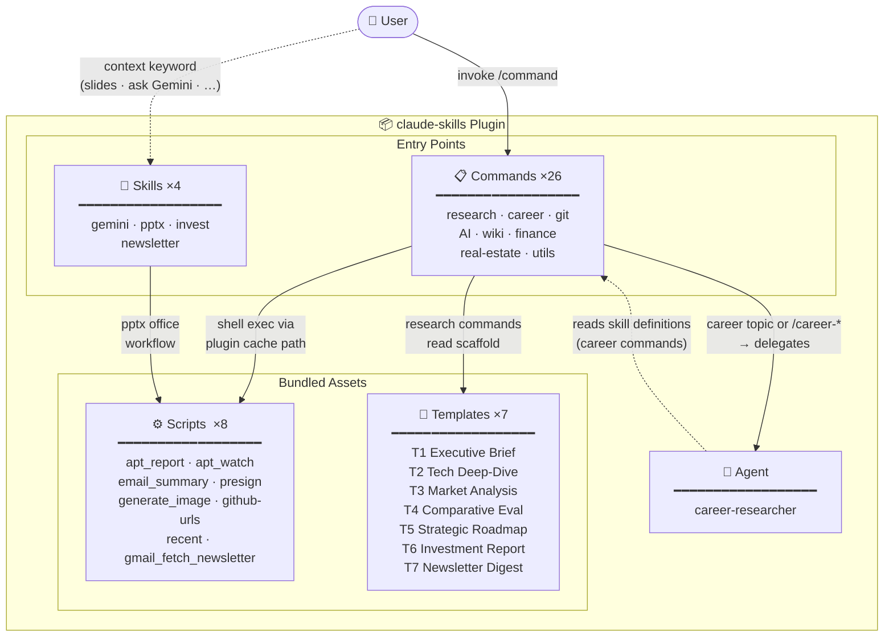

# Claude Skills

> A curated collection of slash commands, skills, and agents for [Claude Code](https://claude.ai/code) — covering research workflows, career development, productivity tools, and automation.


---

## Architecture



---

## What's Included

| Type | Count | Contents |
|------|-------|----------|
| Slash Commands | 26 | Research, career, git, AI tools, productivity, finance, real estate, newsletter |
| Skills | 4 | `gemini` (Gemini CLI wrapper), `pptx` (PowerPoint toolkit), `invest` (portfolio analytics), `newsletter` (Gmail newsletter curation) |
| Agent | 1 | `career-researcher` (dedicated career research sub-agent) |
| Scripts | 8 | Python/shell scripts bundled with commands |
| Templates | 7 | T1–T7 research and curation report templates |

---

## Installation

### Option 1 — Via Marketplace (Recommended)

```
/plugin marketplace add liks79/claude-skills
/plugin install claude-skills@liks79-skills
```

### Option 2 — Direct Install

```bash
claude plugin install liks79/claude-skills --scope user
```

### Option 3 — Manual (`settings.json`)

Add the following to `~/.claude/settings.json`:

```json
{
  "extraKnownMarketplaces": {
    "liks79-skills": {
      "source": {
        "source": "github",
        "repo": "liks79/claude-skills"
      }
    }
  },
  "enabledPlugins": {
    "claude-skills@liks79-skills": true
  }
}
```

---

## Commands

### Research & Knowledge Management

| Command | Description |
|---------|-------------|
| `/claude-skills:new-research <topic>` | Create a structured research note. Auto-selects one of five templates (T1–T5) based on topic keywords. Delegates career topics to the `career-researcher` agent. |
| `/claude-skills:apply-research-template <file> [Template N] [depth]` | Restructure an existing markdown file into a research template. Supports `--inplace` to overwrite the original. |
| `/claude-skills:wiki-ingest <file-or-url>` | Ingest a file, web URL, or YouTube video into an LLM-readable wiki. Extracts concepts and entities, creates cross-linked pages under `wiki/compiled/`. |
| `/claude-skills:wiki-query <question>` | Search the local wiki and synthesize an answer with `[[wikilink]]` citations. Optionally saves the result as a new synthesis page. |
| `/claude-skills:wiki-lint` | Audit wiki health: broken links, orphaned pages, missing frontmatter, stale entries (>90 days). Generates a report with action items. |

### Career Development

| Command | Description |
|---------|-------------|
| `/claude-skills:career-company-analysis <company>` | Web research on a company's tech stack, culture, interview process, and compensation. Saves a structured report to `career/companies/`. |
| `/claude-skills:career-job-analysis <URL-or-text>` | Analyze a job posting. Extracts requirements, performs gap analysis against your background, and lists resume keywords. |
| `/claude-skills:career-interview-prep <company> <role>` | Generate a structured interview prep guide covering coding, system design, behavioral, and technical deep-dive questions. |
| `/claude-skills:career-salary-research <role> [region] [years]` | Research market salary data from Blind, LinkedIn, Levels.fyi, and job boards. Produces a distribution table by experience level. |
| `/claude-skills:career-to-pptx <md-path>` | Convert a career markdown file (company analysis, job analysis, etc.) into a PowerPoint presentation using `python-pptx`. |

### Git & GitHub

| Command | Description |
|---------|-------------|
| `/claude-skills:ship [hint]` | Full git workflow: assess changes → create `claude/*` branch → stage → commit (Conventional Commits) → push → open PR with `gh`. |
| `/claude-skills:github-urls [N]` | Print GitHub URLs for the N most recently changed files in the current repo. |
| `/claude-skills:grass-tracker [username]` | Show GitHub contribution graph status using [grass-tracker](https://github.com/liks79/grass-tracker). Falls back to basic stats via `gh api` if the CLI is not installed. |

### AI Tools

| Command | Description |
|---------|-------------|
| `/claude-skills:gemini <prompt> [--model] [--file] [--diff] [--summary]` | Run a prompt through Google Gemini CLI. Supports code review (`--diff`), file summarization (`--summary`), and model selection. |
| `/claude-skills:image-gen <prompt> [--output] [--model]` | Generate images via Google Gemini API. Supports NanoBanana, NanoBanana 2, NanoBanana Pro, Imagen 4, and Imagen 4 Fast models. |

### Productivity

| Command | Description |
|---------|-------------|
| `/claude-skills:email-summary [days]` | Fetch and classify Gmail messages by importance: 🔴 urgent, 🟡 important, 🔵 informational, ⚪ ads. Default: last 7 days. |
| `/claude-skills:email-archive [N] [--dry-run]` | Fetch unread inbox messages, assign labels via AI (newsletter, career, finance, security, etc.), and archive. Default: 50 messages. Use `--dry-run` to preview without changes. |
| `/claude-skills:newsletter --label <name\|id> [--days N]` | Fetch Gmail messages from a label, classify by topic (AI/BigTech/Startup/Tools), and generate a premium T7 intelligence digest report. Saves to `notes/newsletters/`. |
| `/claude-skills:cal <event>` | Create or view Google Calendar events using natural language input (KST timezone). Supports Google Meet links and attendees. |
| `/claude-skills:presign <file> [hours]` | Upload a file to Cloudflare R2 or AWS S3 and return a presigned URL. Default expiry: 24 hours. |
| `/claude-skills:recent [N]` | List the N most recently modified files in the current directory tree. Default: 10. |

### Finance & Investment

| Command | Description |
|---------|-------------|
| `/invest [sheet_url]` | Read a Google Sheets investment portfolio via GWS CLI, fetch live market data, and generate a premium T6-template report covering allocation, performance, market intelligence, risk matrix, and action plan. Saves to `reports/finance/`. |
| `/share [md_path] [hours]` | Convert the most recent research `.md` to PDF and upload it to Cloudflare R2, returning a presigned URL (and optionally a Quartz URL). Defaults to the most recently modified file under `notes/` or `reports/`. |

### Korea Real Estate

| Command | Description |
|---------|-------------|
| `/claude-skills:apt <region> [--months N] [--type] [--forecast N] [--pdf]` | Generate an apartment price report for Seoul/metropolitan districts using MOLIT official transaction data (data.go.kr). Includes trend charts and 6-month forecast. |
| `/claude-skills:apt-watch <complex> [--name] [--location] [--type] [--pdf]` | Track active listings for a specific apartment complex on Naver Real Estate. Detects new and removed listings via SQLite snapshot comparison. |

### Meta

| Command | Description |
|---------|-------------|
| `/claude-skills:cmds` | List all commands provided by this plugin, grouped by category. |

---

## Skills

Skills are context-loaded automatically by Claude Code based on triggers.

### `gemini`

**Trigger:** User mentions "ask Gemini", "use Gemini CLI", or invokes `/claude-skills:gemini`.

A wrapper around the [Gemini CLI](https://github.com/google-gemini/gemini-cli) for non-interactive use inside Claude Code sessions. Covers single-shot Q&A, stdin piping, code review via `git diff`, and file summarization.

| Model alias | Model ID | Notes |
|-------------|----------|-------|
| (default) | `gemini-2.5-flash` | Fast, general purpose |
| `gemini-2.5-pro` | `gemini-2.5-pro` | High quality, complex reasoning |
| `gemini-2.0-flash` | `gemini-2.0-flash` | Lightweight |

### `invest`

**Trigger:** `/invest` command, or context involving "investment portfolio", "Google Sheets portfolio", "GWS portfolio", or T6 investment report generation.

A portfolio analytics skill that reads holdings from Google Sheets via GWS CLI, computes
per-owner and per-asset-class aggregates, flags concentration risks, and pre-computes all
Mermaid chart numeric arrays for the T6 report template.

| Step | What it does |
|------|-------------|
| 1–3 | Resolve spreadsheet ID, fetch sheet names, read all sheets in parallel |
| 4 | Parse Holdings: owner, asset class, ticker, avg cost, current price, P&L |
| 5 | Compute aggregates: portfolio summary, owner-level, asset class %, rankings, risk flags |
| 6 | Load T6 template via plugin-cache path resolution |
| 7 | Apply Mermaid rendering guidelines (English-only labels, chart type constraints) |

### `newsletter`

**Trigger:** `/newsletter` command, or context involving "curate newsletters from Gmail", "newsletter digest", "Gmail label curation", or T7 newsletter report generation.

A Gmail newsletter curation skill that fetches messages from a specified label via gws CLI,
classifies them into topic buckets, and fills a T7 premium intelligence digest template.

| Step | What it does |
|------|-------------|
| 1–2 | Resolve script path (plugin cache), resolve label ID from name or ID |
| 3 | Fetch up to 40 messages from the label within the date window |
| 4 | Classify each message: AI & Engineering / Big Tech & Investment / Startup & Product / Tools & Infra / Other |
| 5 | Extract top keywords per category for Mermaid mindmap |
| 6 | Build Gantt milestones from event-dated messages |
| 7 | Format each item as analytical summary with filtered links |
| 8 | Compute aggregates: counts, top senders, key insights |
| 9 | Load T7 template via plugin-cache resolution and fill all placeholders |

**Output**: `notes/newsletters/newsletter-{label-slug}-YYYY-MM-DD.md`

**Requirements**: `gws` CLI authenticated, `uv` in PATH, `jq` installed.

---

### `pptx`

**Trigger:** Any `.pptx` file involved, or keywords like "deck", "slides", "presentation".

A complete PowerPoint toolkit with three workflows:

- **Read** — text extraction via `markitdown`, visual thumbnails, raw XML inspection
- **Edit** — unpack → manipulate XML → clean → repack, with subagent-parallel slide editing
- **Create** — from scratch using PptxGenJS with design guidance, color palettes, and typography rules

Includes full QA procedures: content validation, visual inspection via LibreOffice + `pdftoppm`, and a fix-and-verify loop.

---

## Agent

### `career-researcher`

A dedicated sub-agent for career research. Automatically delegated to when:
- `/claude-skills:new-research` detects career-related keywords (job search, interview, salary, etc.)
- Any `/claude-skills:career-*` command is invoked

**Scope:** Creates and updates files only within `career/`.

| Subdirectory | Responsibility |
|--------------|---------------|
| `interview/` | Coding, system design, behavioral prep |
| `job-search/` | Job posting analysis, application strategy |
| `companies/` | Company research, tech stack, culture |
| `skills-roadmap/` | Learning paths, technical roadmaps |
| `resume-portfolio/` | Resume strategy, portfolio structure |
| `salary/` | Salary research, negotiation strategy |
| `networking/` | Community, mentoring, outreach |

---

## Configuration

Some commands require API keys or external CLI tools.

### Environment Variables

Add to `~/.claude/settings.local.json` (never committed to git):

```json
{
  "env": {
    "BASE_DIR":                  "/absolute/path/to/your/workspace",
    "GEMINI_API_KEY":            "your-gemini-api-key",
    "DATA_GO_KR_API_KEY":        "your-data-go-kr-api-key",
    "STORAGE_PROVIDER":          "r2",
    "R2_ACCOUNT_ID":             "your-cloudflare-account-id",
    "R2_ACCESS_KEY_ID":          "your-r2-access-key-id",
    "R2_SECRET_ACCESS_KEY":      "your-r2-secret-access-key",
    "R2_BUCKET_NAME":            "presign-shared",
    "INVEST_DEFAULT_SHEET_URL":  "https://docs.google.com/spreadsheets/d/YOUR_SHEET_ID/edit",
    "QUARTZ_BASE_URL":           "http://your-quartz-host:7000"
  }
}
```

`BASE_DIR` is optional. When set, all commands that generate files (`/claude-skills:new-research`, `/claude-skills:career-*`, `/claude-skills:wiki-*`, `/claude-skills:apt`, `/claude-skills:apt-watch`, `/claude-skills:image-gen`, `/claude-skills:invest`) will write their output under that directory instead of the current working directory. This is useful when you work across multiple projects but want all research notes and reports in one place.

`INVEST_DEFAULT_SHEET_URL` is required by `/claude-skills:invest` when no sheet URL is passed as an argument.

`QUARTZ_BASE_URL` is optional. When set, `/claude-skills:share` appends a Quartz static-site URL alongside the presigned R2 URL. Omit it if you don't run a local Quartz instance.

For AWS S3 instead of R2, replace the `R2_*` keys with `AWS_ACCESS_KEY_ID`, `AWS_SECRET_ACCESS_KEY`, `AWS_DEFAULT_REGION`, and `S3_BUCKET_NAME`.

### External CLI Requirements

| Command(s) | Tool | Install |
|------------|------|---------|
| `/claude-skills:gemini`, `/claude-skills:image-gen` | [Gemini CLI](https://github.com/google-gemini/gemini-cli) | `npm install -g @google/gemini-cli` |
| `/claude-skills:ship`, `/claude-skills:github-urls`, `/claude-skills:grass-tracker` | [GitHub CLI](https://cli.github.com/) | `brew install gh` |
| `/claude-skills:grass-tracker` | [grass-tracker](https://github.com/liks79/grass-tracker) | See repo for install |
| `/claude-skills:cal`, `/claude-skills:email-summary`, `/claude-skills:email-archive`, `/claude-skills:newsletter`, `/claude-skills:invest` | [gws](https://github.com/nicholasgasior/gws) (Google Workspace CLI) | See gws repo; `gws auth login` must be authenticated |
| `/claude-skills:apt`, `/claude-skills:apt-watch`, `/claude-skills:presign`, `/claude-skills:share`, `/claude-skills:email-summary`, `/claude-skills:image-gen`, `/claude-skills:invest` | [uv](https://docs.astral.sh/uv/) | `curl -LsSf https://astral.sh/uv/install.sh \| sh` |
| `/claude-skills:career-to-pptx` | `python-pptx` | Installed automatically via `uv add python-pptx` |
| `pptx` skill | LibreOffice, Poppler | `apt install libreoffice poppler-utils` |

---

## Research Templates

The `/claude-skills:new-research` and `/claude-skills:apply-research-template` commands use a five-tier template system. Templates are auto-selected from topic keywords or can be specified explicitly.

| Template | Name | Best For | Auto-trigger keywords |
|----------|------|----------|-----------------------|
| T1 | Executive Brief | Quick summaries, overviews | (default) |
| T2 | Tech Deep-Dive | Architecture, implementation | "architecture", "deep dive", "analysis" |
| T3 | Market Analysis | Trends, competitive landscape | "market", "trend", "landscape" |
| T4 | Comparative Evaluation | Side-by-side comparisons | "comparison", "vs", "evaluation" |
| T5 | Strategic Roadmap | Plans, phases, milestones | "strategy", "roadmap", "plan" |
| T6 | Investment Report | Portfolio analysis with charts | Used exclusively by `/invest` |
| T7 | Newsletter Digest | Gmail newsletter intelligence digest | Used exclusively by `/newsletter` |

---

## Output Directory Layout

Commands that create files write to the following paths relative to your working directory:

| Command group | Output path |
|---------------|-------------|
| `/claude-skills:new-research` | `notes/<domain>/<topic>.md` |
| `/claude-skills:apply-research-template` | Same directory as input file |
| `/claude-skills:career-*` | `career/<subfolder>/` |
| `/claude-skills:wiki-*` | `wiki/compiled/` |
| `/claude-skills:apt`, `/claude-skills:apt-watch` | `reports/` |
| `/claude-skills:invest` | `reports/finance/investment-report-YYYY-MM-DD.md` |
| `/claude-skills:newsletter` | `notes/newsletters/newsletter-{label-slug}-YYYY-MM-DD.md` |
| `/claude-skills:image-gen` | `notes/image-gen/` (or `--output` path) |

Directories are created automatically on first use. Templates are bundled with the plugin under `templates/research/` and resolved from the plugin cache at runtime — no project setup required.

---

## License

MIT — see [LICENSE](LICENSE)
