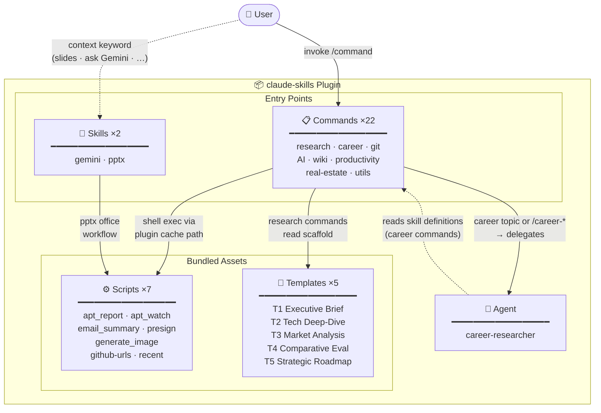

# Claude Skills

> A curated collection of slash commands, skills, and agents for [Claude Code](https://claude.ai/code) — covering research workflows, career development, productivity tools, and automation.


---

## Architecture



---

## What's Included

| Type | Count | Contents |
|------|-------|----------|
| Slash Commands | 22 | Research, career, git, AI tools, productivity, real estate |
| Skills | 2 | `gemini` (Gemini CLI wrapper), `pptx` (PowerPoint toolkit) |
| Agent | 1 | `career-researcher` (dedicated career research sub-agent) |
| Scripts | 7 | Python/shell scripts bundled with commands |

---

## Installation

### Option 1 — Via Marketplace (Recommended)

```
/plugin marketplace add liks79/claude-skills
/plugin install claude-skills@liks79-skills
```

### Option 2 — Direct Install

```bash
claude plugin install liks79/claude-skills --scope user
```

### Option 3 — Manual (`settings.json`)

Add the following to `~/.claude/settings.json`:

```json
{
  "extraKnownMarketplaces": {
    "liks79-skills": {
      "source": {
        "source": "github",
        "repo": "liks79/claude-skills"
      }
    }
  },
  "enabledPlugins": {
    "claude-skills@liks79-skills": true
  }
}
```

---

## Commands

### Research & Knowledge Management

| Command | Description |
|---------|-------------|
| `/new-research <topic>` | Create a structured research note. Auto-selects one of five templates (T1–T5) based on topic keywords. Delegates career topics to the `career-researcher` agent. |
| `/apply-research-template <file> [Template N] [depth]` | Restructure an existing markdown file into a research template. Supports `--inplace` to overwrite the original. |
| `/wiki-ingest <file-or-url>` | Ingest a file, web URL, or YouTube video into an LLM-readable wiki. Extracts concepts and entities, creates cross-linked pages under `WIKI/compiled/`. |
| `/wiki-query <question>` | Search the local wiki and synthesize an answer with `[[wikilink]]` citations. Optionally saves the result as a new synthesis page. |
| `/wiki-lint` | Audit wiki health: broken links, orphaned pages, missing frontmatter, stale entries (>90 days). Generates a report with action items. |

### Career Development

| Command | Description |
|---------|-------------|
| `/career-company-analysis <company>` | Web research on a company's tech stack, culture, interview process, and compensation. Saves a structured report to `20_AREAS/career/companies/`. |
| `/career-job-analysis <URL-or-text>` | Analyze a job posting. Extracts requirements, performs gap analysis against your background, and lists resume keywords. |
| `/career-interview-prep <company> <role>` | Generate a structured interview prep guide covering coding, system design, behavioral, and technical deep-dive questions. |
| `/career-salary-research <role> [region] [years]` | Research market salary data from Blind, LinkedIn, Levels.fyi, and job boards. Produces a distribution table by experience level. |
| `/career-to-pptx <md-path>` | Convert a career markdown file (company analysis, job analysis, etc.) into a PowerPoint presentation using `python-pptx`. |

### Git & GitHub

| Command | Description |
|---------|-------------|
| `/ship [hint]` | Full git workflow: assess changes → create `claude/*` branch → stage → commit (Conventional Commits) → push → open PR with `gh`. |
| `/github-urls [N]` | Print GitHub URLs for the N most recently changed files in the current repo. |
| `/grass-tracker [username]` | Show GitHub contribution graph status using [grass-tracker](https://github.com/liks79/grass-tracker). Falls back to basic stats via `gh api` if the CLI is not installed. |

### AI Tools

| Command | Description |
|---------|-------------|
| `/gemini <prompt> [--model] [--file] [--diff] [--summary]` | Run a prompt through Google Gemini CLI. Supports code review (`--diff`), file summarization (`--summary`), and model selection. |
| `/image-gen <prompt> [--output] [--model]` | Generate images via Google Gemini API. Supports NanoBanana, NanoBanana 2, NanoBanana Pro, Imagen 4, and Imagen 4 Fast models. |

### Productivity

| Command | Description |
|---------|-------------|
| `/email-summary [days]` | Fetch and classify Gmail messages by importance: 🔴 urgent, 🟡 important, 🔵 informational, ⚪ ads. Default: last 7 days. |
| `/cal <event>` | Create or view Google Calendar events using natural language input (KST timezone). Supports Google Meet links and attendees. |
| `/presign <file> [hours]` | Upload a file to Cloudflare R2 or AWS S3 and return a presigned URL. Default expiry: 24 hours. |
| `/recent [N]` | List the N most recently modified files in the current directory tree. Default: 10. |

### Korea Real Estate

| Command | Description |
|---------|-------------|
| `/apt <region> [--months N] [--type] [--forecast N] [--pdf]` | Generate an apartment price report for Seoul/metropolitan districts using MOLIT official transaction data (data.go.kr). Includes trend charts and 6-month forecast. |
| `/apt-watch <complex> [--name] [--location] [--type] [--pdf]` | Track active listings for a specific apartment complex on Naver Real Estate. Detects new and removed listings via SQLite snapshot comparison. |

### Meta

| Command | Description |
|---------|-------------|
| `/cmds` | List all commands provided by this plugin, grouped by category. |

---

## Skills

Skills are context-loaded automatically by Claude Code based on triggers.

### `gemini`

**Trigger:** User mentions "ask Gemini", "use Gemini CLI", or invokes `/gemini`.

A wrapper around the [Gemini CLI](https://github.com/google-gemini/gemini-cli) for non-interactive use inside Claude Code sessions. Covers single-shot Q&A, stdin piping, code review via `git diff`, and file summarization.

| Model alias | Model ID | Notes |
|-------------|----------|-------|
| (default) | `gemini-2.5-flash` | Fast, general purpose |
| `gemini-2.5-pro` | `gemini-2.5-pro` | High quality, complex reasoning |
| `gemini-2.0-flash` | `gemini-2.0-flash` | Lightweight |

### `pptx`

**Trigger:** Any `.pptx` file involved, or keywords like "deck", "slides", "presentation".

A complete PowerPoint toolkit with three workflows:

- **Read** — text extraction via `markitdown`, visual thumbnails, raw XML inspection
- **Edit** — unpack → manipulate XML → clean → repack, with subagent-parallel slide editing
- **Create** — from scratch using PptxGenJS with design guidance, color palettes, and typography rules

Includes full QA procedures: content validation, visual inspection via LibreOffice + `pdftoppm`, and a fix-and-verify loop.

---

## Agent

### `career-researcher`

A dedicated sub-agent for career research. Automatically delegated to when:
- `/new-research` detects career-related keywords (job search, interview, salary, etc.)
- Any `/career-*` command is invoked

**Scope:** Creates and updates files only within `20_AREAS/career/`.

| Subdirectory | Responsibility |
|--------------|---------------|
| `interview/` | Coding, system design, behavioral prep |
| `job-search/` | Job posting analysis, application strategy |
| `companies/` | Company research, tech stack, culture |
| `skills-roadmap/` | Learning paths, technical roadmaps |
| `resume-portfolio/` | Resume strategy, portfolio structure |
| `salary/` | Salary research, negotiation strategy |
| `networking/` | Community, mentoring, outreach |

---

## Configuration

Some commands require API keys or external CLI tools.

### Environment Variables

Add to `~/.claude/settings.local.json` (never committed to git):

```json
{
  "env": {
    "GEMINI_API_KEY":        "your-gemini-api-key",
    "DATA_GO_KR_API_KEY":    "your-data-go-kr-api-key",
    "STORAGE_PROVIDER":      "r2",
    "R2_ACCOUNT_ID":         "your-cloudflare-account-id",
    "R2_ACCESS_KEY_ID":      "your-r2-access-key-id",
    "R2_SECRET_ACCESS_KEY":  "your-r2-secret-access-key",
    "R2_BUCKET_NAME":        "presign-shared"
  }
}
```

For AWS S3 instead of R2, replace the `R2_*` keys with `AWS_ACCESS_KEY_ID`, `AWS_SECRET_ACCESS_KEY`, `AWS_DEFAULT_REGION`, and `S3_BUCKET_NAME`.

### External CLI Requirements

| Command(s) | Tool | Install |
|------------|------|---------|
| `/gemini`, `/image-gen` | [Gemini CLI](https://github.com/google-gemini/gemini-cli) | `npm install -g @google/gemini-cli` |
| `/ship`, `/github-urls`, `/grass-tracker` | [GitHub CLI](https://cli.github.com/) | `brew install gh` |
| `/grass-tracker` | [grass-tracker](https://github.com/liks79/grass-tracker) | See repo for install |
| `/cal` | `gws` (Google Workspace CLI) | See [gws docs](https://github.com/nicholasgasior/gws) |
| `/apt`, `/apt-watch`, `/presign`, `/email-summary`, `/image-gen` | [uv](https://docs.astral.sh/uv/) | `curl -LsSf https://astral.sh/uv/install.sh \| sh` |
| `/email-summary` | Gmail MCP | Enable via Claude Code Gmail integration |
| `/career-to-pptx` | `python-pptx` | Installed automatically via `uv add python-pptx` |
| `pptx` skill | LibreOffice, Poppler | `apt install libreoffice poppler-utils` |

---

## Research Templates

The `/new-research` and `/apply-research-template` commands use a five-tier template system. Templates are auto-selected from topic keywords or can be specified explicitly.

| Template | Name | Best For | Auto-trigger keywords |
|----------|------|----------|-----------------------|
| T1 | Executive Brief | Quick summaries, overviews | (default) |
| T2 | Tech Deep-Dive | Architecture, implementation | "architecture", "deep dive", "analysis" |
| T3 | Market Analysis | Trends, competitive landscape | "market", "trend", "landscape" |
| T4 | Comparative Evaluation | Side-by-side comparisons | "comparison", "vs", "evaluation" |
| T5 | Strategic Roadmap | Plans, phases, milestones | "strategy", "roadmap", "plan" |

---

## Output Directory Layout

Commands that create files write to the following paths relative to your working directory:

| Command group | Output path |
|---------------|-------------|
| `/new-research` | `notes/<domain>/<topic>.md` |
| `/apply-research-template` | Same directory as input file |
| `/career-*` | `career/<subfolder>/` |
| `/wiki-*` | `wiki/compiled/` |
| `/apt`, `/apt-watch` | `reports/` |
| `/image-gen` | `notes/image-gen/` (or `--output` path) |

Directories are created automatically on first use. Templates are bundled with the plugin under `templates/research/` and resolved from the plugin cache at runtime — no project setup required.

---

## License

MIT — see [LICENSE](LICENSE)
