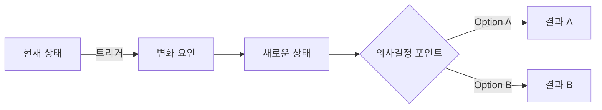

# [제목] — Executive Brief

> **TL;DR**: [한 문장 핵심 메시지. 이것만 읽어도 리포트의 결론을 알 수 있어야 한다.]

**Published**: YYYY-MM-DD | **Area**: [domain] | **Confidence**: ⭐⭐⭐⭐☆

---

## Executive Summary

| | |
|---|---|
| **핵심 인사이트** | [bullet — depth: quick=1개 / standard=3개 / deep=5개 / exhaustive=제한없음] |
| **추천 액션** | [즉시 실행 가능한 액션] |
| **리스크** | [주요 우려 사항] |

### Key Findings

> 01 · **[발견 1 제목]**
> [depth에 따라 서술 깊이 조정]

> 02 · **[발견 2 제목]**
> [depth에 따라 서술 깊이 조정]

> 03 · **[발견 3 제목]**
> [depth에 따라 서술 깊이 조정]

---

## Situation Overview

<!-- depth: quick → 1단락 / standard → 3단락 / deep → 섹션별 근거 포함 / exhaustive → 케이스스터디 포함 -->
[현재 상황 또는 문제 배경. 왜 이 주제가 중요한가?]

---

## Analysis

### [분석 섹션 1]

<!-- depth: quick → bullet만 / standard → 주장+근거 / deep → 주장+근거+반례 / exhaustive → 데이터+통계 포함 -->
- **Evidence**: 
- **Interpretation**: 
- **Implication**: 

### [분석 섹션 2]

- **Evidence**: 
- **Interpretation**: 
- **Implication**: 

---

## Recommendations

| 우선순위 | 액션 | 기대 효과 | 기간 |
|----------|------|-----------|------|
| 🔴 High  | | | 즉시 |
| 🟡 Med   | | | 1개월 |
| 🟢 Low   | | | 분기 |

---

## References

- [출처 1](URL) — YYYY-MM-DD 확인
- [출처 2](URL) — YYYY-MM-DD 확인
