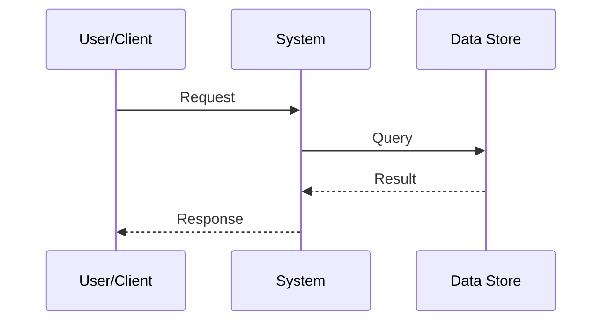
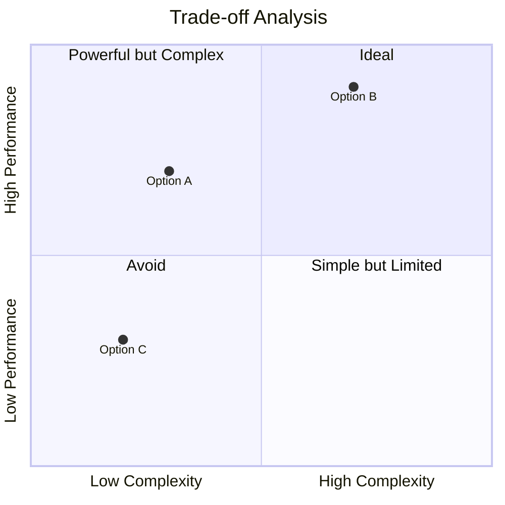
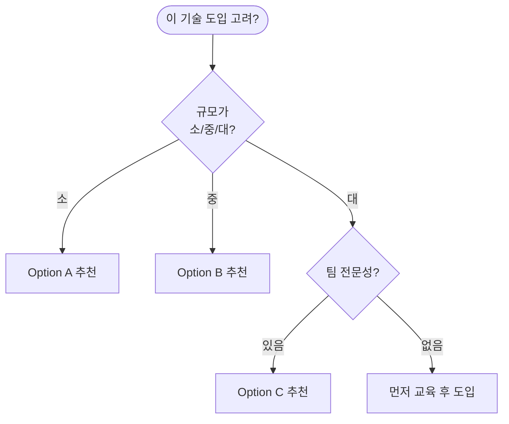

# [기술명] — Deep-Dive Analysis

**Date**: YYYY-MM-DD | **Area**: [domain] | **Status**: 🔬 In Progress → ✅ Completed

---

## Abstract

<!-- depth: quick → TL;DR 1문장 / standard → 3~5문장 / deep → 배경·방법·결론 단락 / exhaustive → 구조화된 요약 + 범위 정의 -->
[무엇을, 왜, 어떻게 분석했고 결론이 무엇인지. depth에 따라 서술 깊이 조정.]

---

## 01 · Technology Overview

### Definition & Scope

<!-- depth: quick → 1~2줄 정의 / standard → 정의 + 범위 / deep → 정의 + 역사 + 변형 / exhaustive → 학술적 정의 + 표준 포함 -->
[기술의 정확한 정의와 범위]

### How It Works



### Key Components

```
┌──────────────────────────────────────────┐
│              [기술명] 아키텍처            │
├──────────────┬───────────────────────────┤
│  Layer 1     │  [컴포넌트 A] [컴포넌트 B] │
├──────────────┼───────────────────────────┤
│  Layer 2     │  [컴포넌트 C] [컴포넌트 D] │
├──────────────┼───────────────────────────┤
│  Layer 3     │  [컴포넌트 E]              │
└──────────────┴───────────────────────────┘
```

---

## 02 · Market Landscape

### Technology Maturity (Hype Cycle Position)

```
혁신 → 거품 → 환멸 → 회복 → 안정
  ●         ●         ●       ●       ●
             ▲
        [현재 위치]
```

### Key Players

<!-- depth: quick → 상위 3개 / standard → 5개 + 특징 / deep → 포지셔닝 분석 포함 / exhaustive → 시장 점유율 데이터 포함 -->
| 플레이어 | 포지션 | 강점 | 약점 |
|---------|--------|------|------|
| | | | |

---

## 03 · Technical Analysis

### Performance Benchmarks

<!-- depth: quick → 생략 가능 / standard → 주요 지표만 / deep → 전체 벤치마크 / exhaustive → 원본 데이터 + 방법론 -->
| 지표 | 측정값 | 비교 기준 | 평가 |
|------|--------|-----------|------|
| | | | ✅/⚠️/❌ |

### Architectural Trade-offs



### Code Example / Implementation

```python
# 핵심 구현 예시
# [코드 또는 설정 스니펫]
```

---

## 04 · Strengths & Limitations

### ✅ Strengths
<!-- depth: quick → 2개 / standard → 3~4개 / deep → 근거 포함 / exhaustive → 수치 데이터 포함 -->
1. **[강점 1]**: [설명]
2. **[강점 2]**: [설명]

### ⚠️ Limitations & Risks
1. **[한계 1]**: [설명] → *Mitigation*: [대응]
2. **[한계 2]**: [설명] → *Mitigation*: [대응]

---

## 05 · Recommendations & Next Steps

### Decision Framework



### Action Items

- [ ] [즉시 액션 1]
- [ ] [단기 액션 2]
- [ ] [중기 액션 3]

---

## Appendix

<!-- depth: quick/standard → 생략 가능 / deep → Glossary 포함 / exhaustive → 전체 포함 -->

### Glossary
| 용어 | 정의 |
|------|------|
| | |

### Methodology
[데이터 수집 방법, 분석 기준]

## References
- [출처](URL) — YYYY-MM-DD
