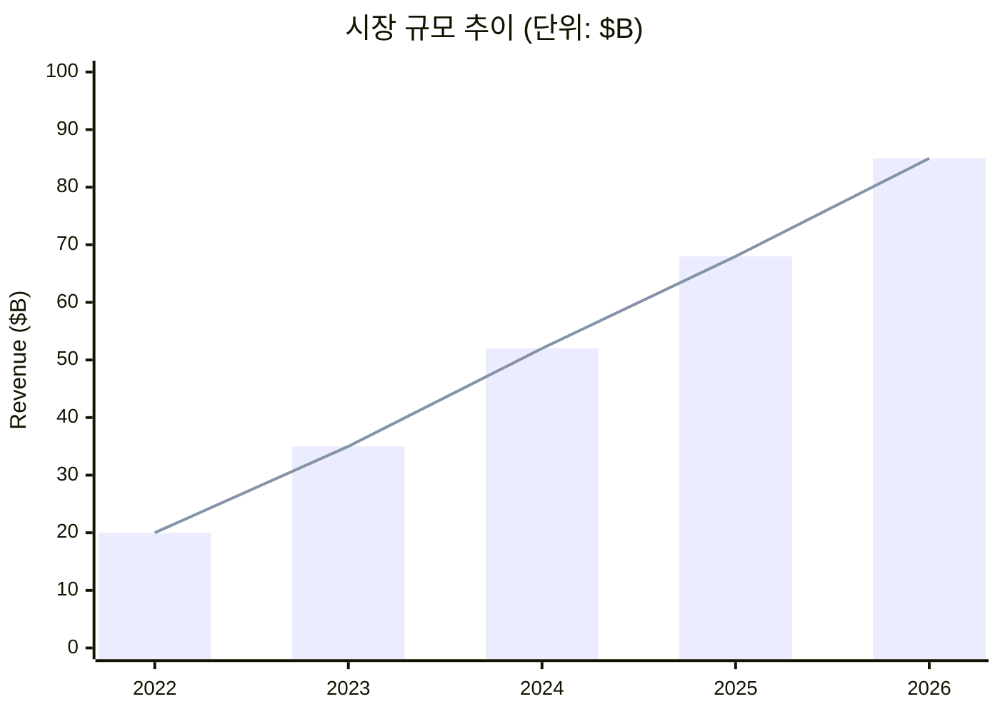
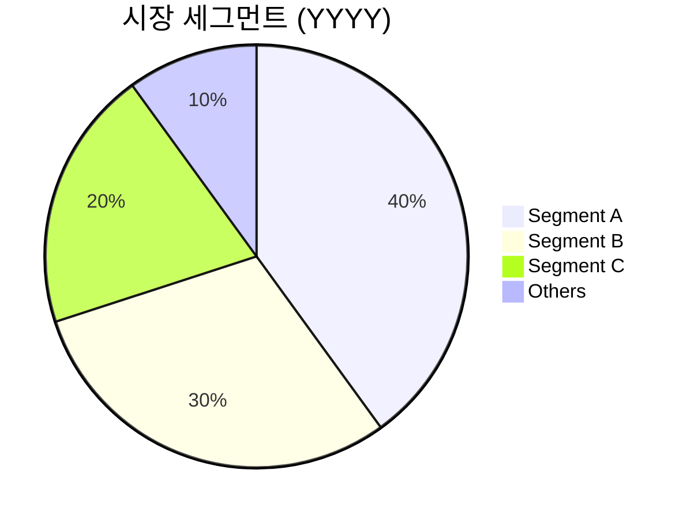
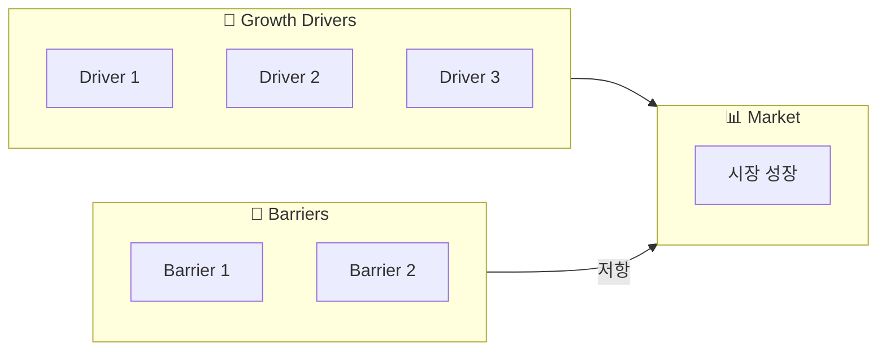
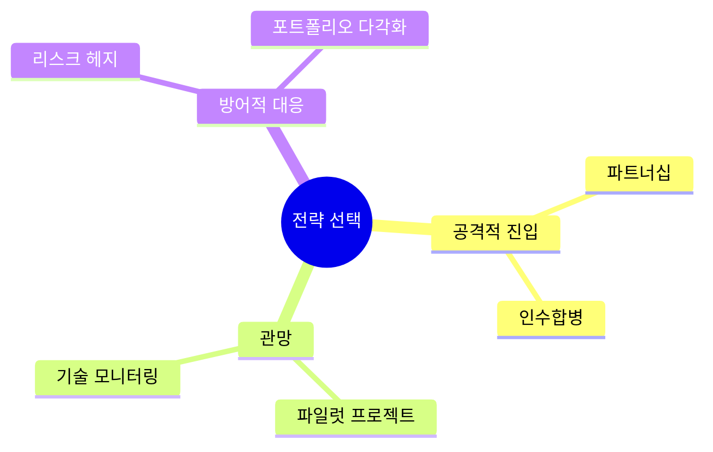

# [시장/트렌드명] — Market Analysis Report

**Date**: YYYY-MM-DD | **Scope**: [지역/산업] | **Data As Of**: YYYY

---

## Executive Summary

```
╔══════════════════════════════════════════════════════╗
║  MARKET SNAPSHOT                                      ║
║                                                       ║
║  시장 규모    $XXB (YYYY)   →  $XXB (YYYY, forecast)  ║
║  CAGR         XX%                                     ║
║  핵심 동인    [키워드 3개]                             ║
║  최대 리스크  [리스크 1개]                             ║
╚══════════════════════════════════════════════════════╝
```

<!-- depth: quick → Takeaway 1개 / standard → 3개 / deep → 5개 + 근거 / exhaustive → 섹션별 전체 -->
**Key Takeaways**
1. 📈 **[트렌드 1]** — [설명]
2. 🔄 **[트렌드 2]** — [설명]
3. ⚡ **[트렌드 3]** — [설명]

---

## Market Overview

### Size & Growth



### Market Segmentation



---

## Competitive Landscape

### Key Players Matrix

<!-- depth: quick → 상위 3개 / standard → 5~7개 / deep → 점유율+전략 포함 / exhaustive → 재무 데이터 포함 -->
| 플레이어 | 시장 점유율 | 핵심 강점 | 전략 방향 | 위협도 |
|---------|------------|-----------|-----------|--------|
| | | | | 🔴🟡🟢 |

### Positioning Map

```
        높은 기술력
             ↑
[Player A]   │   [Player B]
             │
낮은 가격 ───┼─── 높은 가격
             │
[Player C]   │   [Player D]
             ↓
        낮은 기술력
```

---

## Trend Analysis

### Driver & Barrier Analysis



### Technology Adoption Curve

```
얼리어답터  ─────────────→  주류 시장  ─────────────→  레이트 매조리티
    │                           │                           │
 [현재 단계]              [예상 주류화]              [성숙 단계]
 YYYY                     YYYY                       YYYY
```

---

## Strategic Implications

### Scenario Analysis

<!-- depth: quick → Base만 / standard → 3개 시나리오 / deep → 확률 근거 포함 / exhaustive → 민감도 분석 포함 -->
| 시나리오 | 확률 | 영향 | 대응 전략 |
|---------|------|------|-----------|
| Base Case | XX% | | |
| Bull Case | XX% | | |
| Bear Case | XX% | | |

---

## Recommendations

### Strategic Options



## References
- [출처](URL) — YYYY-MM-DD
