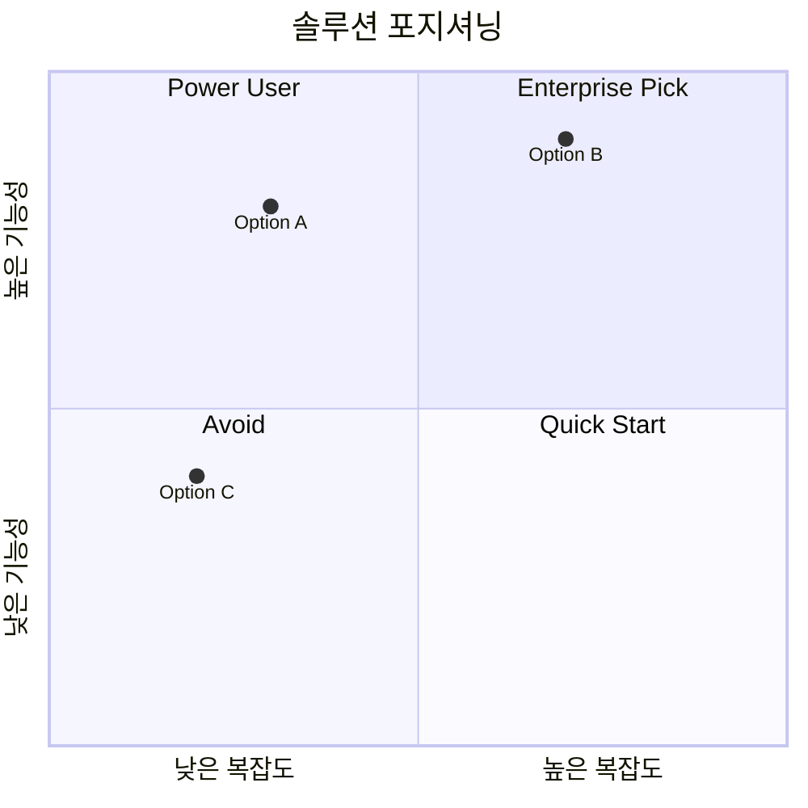

# [비교 주제] — Comparative Evaluation

**Date**: YYYY-MM-DD | **Evaluator**: [팀/개인] | **Decision Deadline**: YYYY-MM-DD

---

## Abstract

<!-- depth: quick → 결론 1문장 / standard → 비교 기준 + 결론 / deep → 배경·기준·결론·한계 / exhaustive → 완전한 평가 맥락 -->
[무엇을 왜 비교하는지, 어떤 기준으로 평가했고 결론은 무엇인지. depth에 따라 서술 깊이 조정.]

---

## Evaluation Criteria

### Scoring Matrix

<!-- depth: quick → 핵심 기준 3개 / standard → 5개 / deep → 가중치 근거 포함 / exhaustive → 이해관계자 인터뷰 기반 -->
| 평가 기준 | 가중치 | 설명 |
|-----------|--------|------|
| 기술 성숙도 | 25% | 안정성, 버전, 커뮤니티 |
| 기능 적합성 | 30% | 요구사항 충족도 |
| 운영 복잡도 | 20% | 설치, 유지보수, 학습 곡선 |
| 비용 효율   | 15% | TCO, 라이선스 |
| 생태계      | 10% | 통합, 플러그인, 지원 |

---

## Options Overview

```
┌─────────────────────────────────────────────────────┐
│  OPTION COMPARISON SNAPSHOT                          │
├─────────────┬──────────────┬──────────────┬─────────┤
│             │  Option A    │  Option B    │Option C │
├─────────────┼──────────────┼──────────────┼─────────┤
│ 유형        │              │              │         │
│ 가격        │              │              │         │
│ 라이선스    │              │              │         │
│ 출시연도    │              │              │         │
│ GitHub ⭐   │              │              │         │
└─────────────┴──────────────┴──────────────┴─────────┘
```

---

## Detailed Evaluation

### Option A — [이름]

**Overall Score: X.X / 5.0** ████████░░

<!-- depth: quick → 점수 + Pros/Cons만 / standard → 기준별 점수 + 근거 / deep → 실사용 사례 포함 / exhaustive → PoC 결과 포함 -->
| 기준 | 점수 | 근거 |
|------|------|------|
| 기술 성숙도 | ⭐⭐⭐⭐☆ | |
| 기능 적합성 | ⭐⭐⭐⭐⭐ | |
| 운영 복잡도 | ⭐⭐⭐☆☆ | |
| 비용 효율   | ⭐⭐⭐⭐☆ | |
| 생태계      | ⭐⭐⭐⭐☆ | |

**Pros**: [강점]
**Cons**: [약점]
**Best for**: [이 옵션이 가장 적합한 상황]

### Option B — [이름]

[동일 구조]

### Option C — [이름]

[동일 구조]

---

## Comparative Visualization

### Radar Chart (텍스트 기반)

```
         기술 성숙도
              5
              │
    4 ────────┼──────── 4
   /          │          \
  3     A  ●  │  ●  B     3
   \          │          /
    2 ────────┼──────── 2
              │  ● C
              1
         비용 효율
```

### Decision Matrix Result



---

## Final Recommendation

> **Winner**: **[Option X]** — [선택 이유]

### Conditional Recommendations

| 상황 | 추천 | 이유 |
|------|------|------|
| 빠른 시작이 필요할 때 | Option C | |
| 최고 성능이 필요할 때 | Option B | |
| 균형 잡힌 선택 | Option A | |

## References
- [출처](URL) — YYYY-MM-DD
