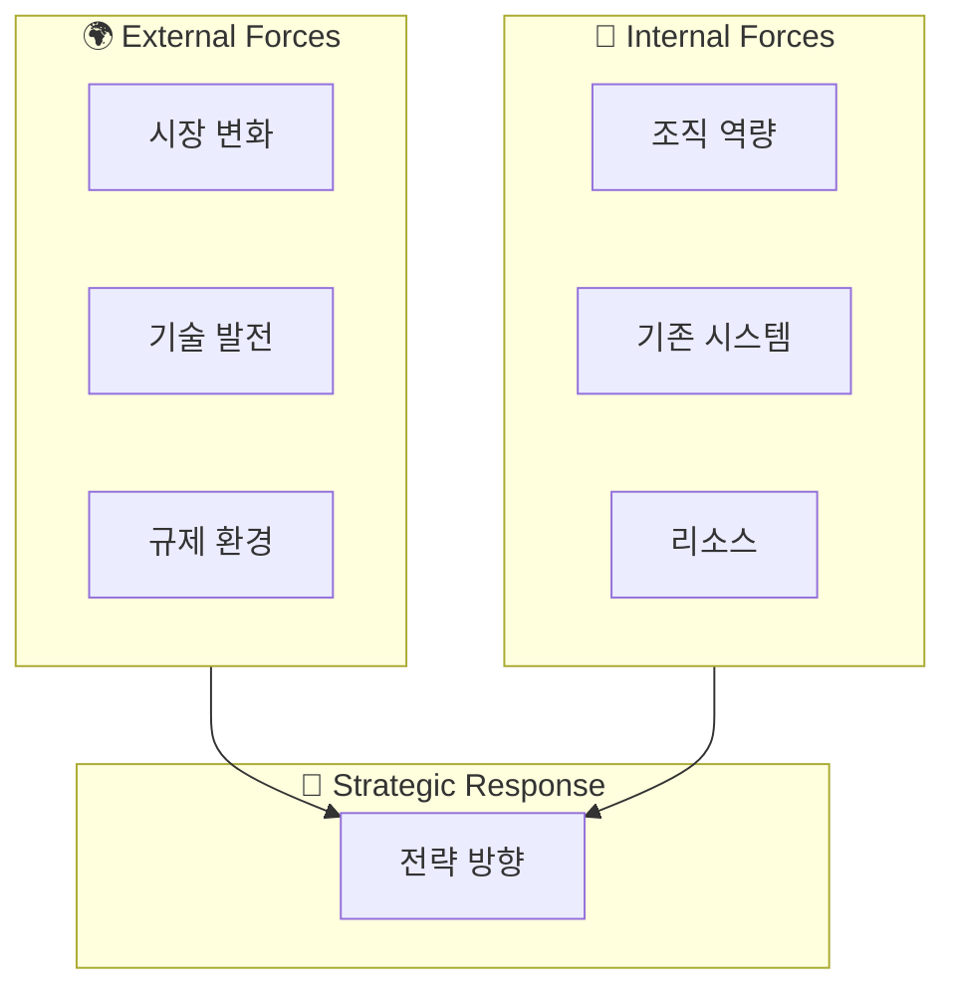
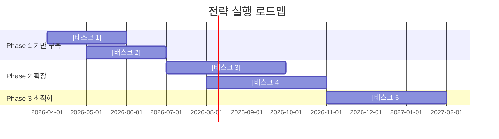
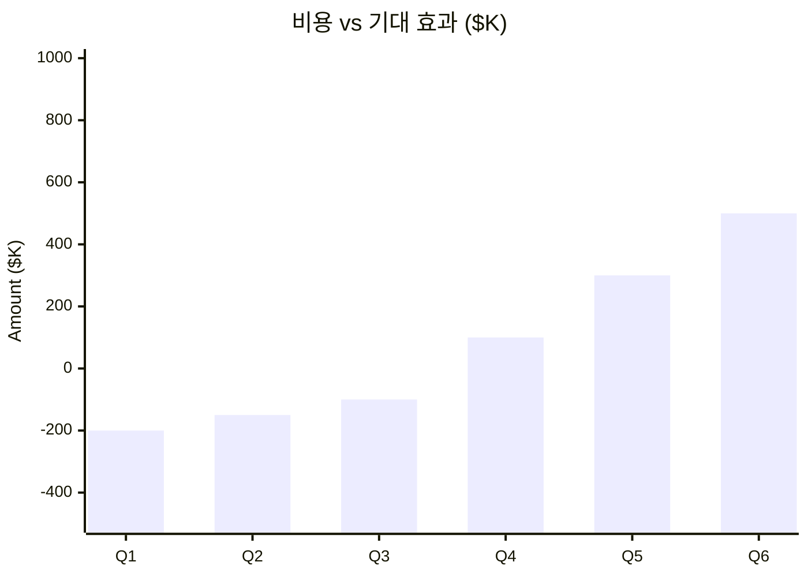

# [주제] — Strategic Roadmap

**Date**: YYYY-MM-DD | **Horizon**: [기간] | **Owner**: [담당자]

---

## Abstract

<!-- depth: quick → 목표 1문장 / standard → 목표·배경·방향성 / deep → 현황·목표·전략·기대효과 / exhaustive → 완전한 전략 맥락 + 전제 조건 -->
[전략의 목표, 배경, 핵심 방향성. depth에 따라 서술 깊이 조정.]

---

## Strategic Context

### Why Now?

```
과거 상황          현재 전환점             미래 목표
    │                   │                     │
────●───────────────────●─────────────────────●────→
 YYYY                  NOW                  YYYY
[기존 방식]        [변화 트리거]          [목표 상태]
```

### Forces Shaping the Landscape



---

## Current State Assessment

### Maturity Assessment

<!-- depth: quick → 생략 가능 / standard → 주요 영역만 / deep → 갭 분석 포함 / exhaustive → 벤치마크 대비 비교 -->
| 영역 | 현재 수준 | 목표 수준 | 갭 |
|------|-----------|-----------|-----|
| [영역 1] | ██░░░ 2/5 | █████ 5/5 | ▲3 |
| [영역 2] | ███░░ 3/5 | ████░ 4/5 | ▲1 |
| [영역 3] | █░░░░ 1/5 | ████░ 4/5 | ▲3 |

### SWOT Analysis

```
┌─────────────────────┬─────────────────────┐
│    STRENGTHS        │    WEAKNESSES        │
│  S1. [강점]         │  W1. [약점]          │
│  S2.                │  W2.                 │
├─────────────────────┼─────────────────────┤
│    OPPORTUNITIES    │    THREATS           │
│  O1. [기회]         │  T1. [위협]          │
│  O2.                │  T2.                 │
└─────────────────────┴─────────────────────┘
```

---

## Strategic Roadmap

### Phased Execution Plan



### Milestone Map

| Phase | 기간 | 목표 | 성공 지표 | 투자 규모 |
|-------|------|------|-----------|-----------|
| **Phase 1** 기반 | Q2 2026 | | | |
| **Phase 2** 확장 | Q3 2026 | | | |
| **Phase 3** 최적화 | Q4 2026 | | | |

---

## Risk & Mitigation

### Risk Heatmap

```
  높음 │  [리스크C]  │  [리스크A]  │
       │             │             │
  중간 │             │  [리스크B]  │  [리스크D]
       │             │             │
  낮음 │             │             │
       └─────────────┴─────────────┴──────────
           낮은 발생   중간 발생     높은 발생
```

<!-- depth: quick → 상위 2개만 / standard → 주요 리스크 / deep → 대응 전략 상세 / exhaustive → 컨틴전시 플랜 포함 -->
| 리스크 | 발생 가능성 | 영향도 | 대응 전략 | 담당 |
|--------|------------|--------|-----------|------|
| | 🔴/🟡/🟢 | 🔴/🟡/🟢 | | |

---

## Investment & Return

### ROI Projection



---

## Action Items & Owners

### Immediate Actions (Next 30 Days)

- [ ] **[액션 1]** — Owner: [담당] | Due: YYYY-MM-DD
- [ ] **[액션 2]** — Owner: [담당] | Due: YYYY-MM-DD
- [ ] **[액션 3]** — Owner: [담당] | Due: YYYY-MM-DD

### Quarterly Reviews

| 분기 | 리뷰 포인트 | 성공 기준 |
|------|------------|-----------|
| Q1 | | |
| Q2 | | |

---

## Appendix

<!-- depth: quick/standard → 생략 가능 / deep → Assumptions 포함 / exhaustive → 전체 포함 -->

### Assumptions & Constraints
-

### Data Sources & Methodology
-

## References
- [출처](URL) — YYYY-MM-DD
