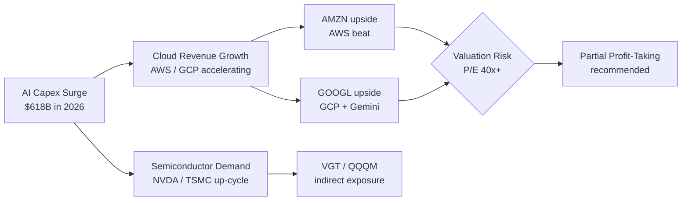

<div style="text-align:center; padding: 2em 0 1em 0;">

# Family Investment Portfolio Report

**[YYYY-MM-DD]** &nbsp;|&nbsp; Exchange Rate **[rate] KRW/USD**

</div>

---

> **Total Value** [total value] &nbsp;▪&nbsp; **Total P&L** [total P&L] ([return %]) &nbsp;▪&nbsp; **Holdings** [count] assets &nbsp;▪&nbsp; **FX Rate** [rate] KRW/USD

---

## 1. Executive Summary

### Key Findings

| # | Category | Finding | Impact |
|---|----------|---------|--------|
| 1 | 🔴 Risk | [most critical concentration risk — one line] | High |
| 2 | 🟡 Watch | [market variable to monitor — one line] | Medium |
| 3 | 🟢 Opportunity | [actionable opportunity — one line] | High |

### Portfolio Scorecard

| Metric | Value | Benchmark | Status |
|--------|-------|-----------|--------|
| Total Return (Inception) | [total return %] | S&P 500 YTD | [▲/▼/■] |
| USD/KRW Exposure | [USD asset weight]% | — | [▲ FX risk / ■ acceptable] |
| Single-Stock Concentration | [largest single-stock weight]% | Max 20% | [🔴/🟢] |
| Cash Drag (idle cash) | [cash weight]% | Max 5% | [🔴/🟢] |
| Loss Positions | [count] | 0 | [🔴/🟢] |

---

## 2. Portfolio Composition

### Asset Allocation


### Holdings Summary by Owner

| Owner | Invested (KRW) | Current Value (KRW) | P&L (KRW) | Return |
|-------|---------------|---------------------|-----------|--------|
| [owner 1] | [invested] | [value] | [P&L] | **[return %]** |
| [owner 2] | [invested] | [value] | [P&L] | **[return %]** |
| [owner 3] | [invested] | [value] | [P&L] | **[return %]** |
| [owner 4] | [invested] | [value] | [P&L] | **[return %]** |
| **Total** | **[total]** | **[total]** | **[total]** | **[total]** |

---

## 3. Performance Analysis

### Return Attribution by Asset Class

```mermaid
xychart-beta horizontal
    title "P&L by Asset Class (KRW million)"
    x-axis ["US Stocks", "US ETFs", "KR ETFs", "Gold", "Crypto", "Cash"]
    y-axis "P&L (M KRW)" -50 --> 300
    bar [[US stocks P&L M], [US ETF P&L M], [KR ETF P&L M], [gold P&L M], [BTC P&L M], [cash P&L M]]
```

### Top Performers

| Rank | Asset | Owner | Avg Cost | Current | Return | Value (KRW) |
|------|-------|-------|---------|---------|--------|------------|
| 1 | [asset] | [owner] | [avg cost] | [current] | **[return %]** | [value] |
| 2 | [asset] | [owner] | [avg cost] | [current] | **[return %]** | [value] |
| 3 | [asset] | [owner] | [avg cost] | [current] | **[return %]** | [value] |
| 4 | [asset] | [owner] | [avg cost] | [current] | **[return %]** | [value] |
| 5 | [asset] | [owner] | [avg cost] | [current] | **[return %]** | [value] |

### Loss Positions — Action Required

| Asset | Owner | Avg Cost | Current | Return | Loss (KRW) | Recommended Action |
|-------|-------|---------|---------|--------|------------|-------------------|
| [asset] | [owner] | [avg cost] | [current] | **[return %]** | [loss amount] | [action] |

---

## 4. Market Intelligence

### 4.1 USD/KRW Exchange Rate

**Current Rate**: [current rate] KRW/USD

```mermaid
xychart-beta
    title "USD/KRW Forecast (KRW per 1 USD)"
    x-axis ["Current", "Jun", "Jul", "Aug", "Sep"]
    y-axis "KRW" 1400 --> 1650
    line [[current rate], [Jun forecast], [Jul forecast], [Aug forecast], [Sep forecast]]
    bar  [[current rate], [Jun high], [Jul high], [Aug high], [Sep high]]
```

| Period | Range | Month-end Forecast | Trend |
|--------|-------|--------------------|-------|
| Current | — | [current rate] | — |
| Jun [year] | [range] | [forecast] | [direction] |
| Jul [year] | [range] | [forecast] | [direction] |
| Aug [year] | [range] | [forecast] | [direction] |

**Portfolio FX Impact**: USD assets exposed at [amount] KRW. A 100 KRW move in the rate changes portfolio value by ±[impact amount] KRW.

---

### 4.2 U.S. Economic Events Calendar

```mermaid
gantt
    title US Economic Event Calendar (Next 8 Weeks)
    dateFormat YYYY-MM-DD
    section Fed / Rates
    FOMC Meeting         : [FOMC start date], [FOMC end date]
    section Inflation
    CPI Release          : milestone, [CPI date], 0d
    PCE Release          : milestone, [PCE date], 0d
    section Employment
    NFP / Jobs Report    : milestone, [NFP date], 0d
    section Earnings
    Big Tech Earnings    : [earnings start date], [earnings end date]
```

| Date | Event | Expected | Market Impact on Holdings |
|------|-------|----------|--------------------------|
| [date] | FOMC rate decision | [expected] | SCHD, dividend stocks [impact] |
| [date] | CPI release | [expected] | Persistent inflation → dollar [impact] |
| [date] | Jobs report | [expected] | Growth vs. dividend stocks [impact] |

---

### 4.3 Big Tech & AI Sector Outlook



| Company/ETF | Holdings | Recent Trend | 6M Outlook | Risk |
|-------------|---------|-------------|-----------|------|
| AMZN | [value] | [trend] | [outlook] ★★★★☆ | [risk] |
| GOOGL | [value] | [trend] | [outlook] ★★★★☆ | [risk] |
| VGT | [value] | [trend] | [outlook] ★★★☆☆ | [risk] |
| QQQM | [value] | [trend] | [outlook] ★★★☆☆ | [risk] |
| SCHD | [value] | [trend] | [outlook] ★★★★☆ | [risk] |

---

### 4.4 Bitcoin Trend & Crypto Outlook

| Metric | Value |
|--------|-------|
| Current BTC Price (KRW) | [current price] |
| Portfolio BTC Cost (KRW) | [avg cost] |
| Portfolio P&L | [P&L] ([return %]) |
| Portfolio Weight | [weight]% |

**Outlook**: [BTC outlook summary 2–3 sentences. Include whether the small position size limits overall portfolio impact.]

---

### 4.5 Korea Economy & KOSPI

| Indicator | [Year] Forecast | Impact on Holdings |
|-----------|----------------|-------------------|
| GDP Growth | [forecast]% | [impact] |
| BOK Base Rate | [forecast]% | [impact] |
| KRW Trend | [forecast] | USD asset KRW valuation [impact] |
| KOSPI Outlook | [forecast] | Korean equity holdings [impact] |
| Semiconductor Export | [forecast] | VGT/QQQM indirect [impact] |

---

## 5. Risk Assessment

### Risk Matrix

```mermaid
quadrantChart
    title Portfolio Risk Matrix (Probability vs Impact)
    x-axis Low Probability --> High Probability
    y-axis Low Impact --> High Impact
    quadrant-1 Monitor Closely
    quadrant-2 Critical — Act Now
    quadrant-3 Accept
    quadrant-4 Hedge / Reduce
    [Risk 1 (e.g. Single-stock AMZN)]: [x, y]
    [Risk 2 (e.g. FX Rate Spike)]: [x, y]
    [Risk 3 (e.g. Big Tech Correction)]: [x, y]
    [Risk 4 (e.g. Position Decline)]: [x, y]
    [Risk 5 (e.g. BTC Volatility)]: [x, y]
```

### Risk Register

| Risk | Probability | Impact | Score | Mitigation Strategy | Owner |
|------|------------|--------|-------|-------------------|-------|
| [risk 1] | 🟡 Medium | 🔴 High | **9** | [mitigation] | [owner] |
| [risk 2] | 🟡 Medium | 🟡 Medium | **6** | [mitigation] | [owner] |
| [risk 3] | 🔴 High | 🟢 Low | **4** | [mitigation] | [owner] |
| [risk 4] | 🟢 Low | 🟢 Low | **1** | [mitigation] | [owner] |

---

## 6. Investment Strategy

### 6.1 Strategic Assessment

| | **Strengths** | **Weaknesses** |
|---|---|---|
| **Internal** | [S1] Long-term holdings with strong gains<br>[S2] Diversified ETFs (SCHD, VGT)<br>[S3] Gold as a hedge asset | [W1] Single-stock concentration<br>[W2] Excess non-liquid assets<br>[W3] Unresolved loss positions |
| | **Opportunities** | **Threats** |
| **External** | [O1] Fed rate cuts → dividend stocks<br>[O2] Optimal timing for profit-taking<br>[O3] Pension cash reallocation | [T1] Big Tech valuation ceiling<br>[T2] USD/KRW volatility<br>[T3] Regulatory risk (specific positions) |

### 6.2 Target vs. Current Allocation

```mermaid
xychart-beta
    title "Current vs. Target Asset Allocation (%)"
    x-axis ["US Stocks", "US ETFs", "KR ETFs", "Bonds/Defensive", "Gold", "Cash", "Crypto"]
    y-axis "Allocation (%)" 0 --> 50
    bar [[current 1], [current 2], [current 3], [current 4], [current 5], [current 6], [current 7]]
    line [[target 1], [target 2], [target 3], [target 4], [target 5], [target 6], [target 7]]
```

### 6.3 Execution Roadmap

```mermaid
gantt
    title Investment Execution Roadmap
    dateFormat YYYY-MM
    section Phase 1 — Risk Cleanup
    Stop-loss decisions       : [start], [end]
    Tax simulation            : [start], [end]
    section Phase 2 — Rebalancing
    Partial sale (30%)        : [start], [end]
    Pension cash to ETF       : [start], [end]
    Add defensive ETF (AGG)   : [start], [end]
    section Phase 3 — Optimization
    Children accounts setup   : [start], [end]
    Gold allocation increase  : [start], [end]
    FX hedge ETF review       : [start], [end]
```

| Phase | Period | Objective | Success Criteria |
|-------|--------|-----------|-----------------|
| **Phase 1** Risk Cleanup | [period] | [objective] | [criteria] |
| **Phase 2** Rebalancing | [period] | [objective] | [criteria] |
| **Phase 3** Optimization | [period] | [objective] | [criteria] |

---

## 7. Action Plan

### Priority Matrix

```mermaid
quadrantChart
    title Action Priority Matrix (Urgency vs Impact)
    x-axis Low Urgency --> High Urgency
    y-axis Low Impact --> High Impact
    quadrant-1 Schedule
    quadrant-2 Do First
    quadrant-3 Deprioritize
    quadrant-4 Delegate / Monitor
    [Action 1 name]: [x, y]
    [Action 2 name]: [x, y]
    [Action 3 name]: [x, y]
    [Action 4 name]: [x, y]
    [Action 5 name]: [x, y]
```

### Immediate Actions — Within 30 Days

| # | Action | Owner | Account | Expected Outcome | Deadline |
|---|--------|-------|---------|-----------------|----------|
| 1 | [action 1 — include asset name, quantity, amount] | [owner] | [account] | [expected outcome] | [date] |
| 2 | [action 2] | [owner] | [account] | [expected outcome] | [date] |
| 3 | [action 3] | [owner] | [account] | [expected outcome] | [date] |

### Short-term Actions — Within 3 Months

- [ ] **[action]** — [owner] / [account] | [specific quantity and amount] | Due: [date]
- [ ] **[action]** — [owner] / [account] | [specific quantity and amount] | Due: [date]
- [ ] **[action]** — [owner] / [account] | [specific quantity and amount] | Due: [date]

### Mid-term Actions — 3–12 Months

- [ ] **[action]** — [owner] | [description]
- [ ] **[action]** — [owner] | [description]
- [ ] **[action]** — [owner] | [description]

---

## 8. Appendix

### Full Holdings by Account

| Account | Owner | Asset | Ticker | Qty | Avg Cost | Current | Value (KRW) | Return |
|---------|-------|-------|--------|-----|---------|---------|------------|--------|
| [account] | [owner] | [asset name] | [ticker] | [qty] | [cost] | [current] | [value] | [return %] |

### Tax Considerations

| Item | Detail |
|------|--------|
| Overseas stock capital gains tax | Annual exemption: first KRW 2.5M; excess taxed at 22% |
| Estimated tax on sale | [tax simulation amount based on current gain] |
| Spousal gift allowance | KRW 600M (10-year cumulative) |
| Child gift allowance | KRW 50M per child (10-year cumulative) |

### Data Sources

| Source | Description | URL |
|--------|-------------|-----|
| Google Sheets | Holdings sheet as of [date] | [sheet URL] |
| FX Forecast | [source] | [URL] |
| FOMC Calendar | Federal Reserve | [URL] |
| Market Data | [source] | [URL] |
| Korea Economy | [source] | [URL] |
